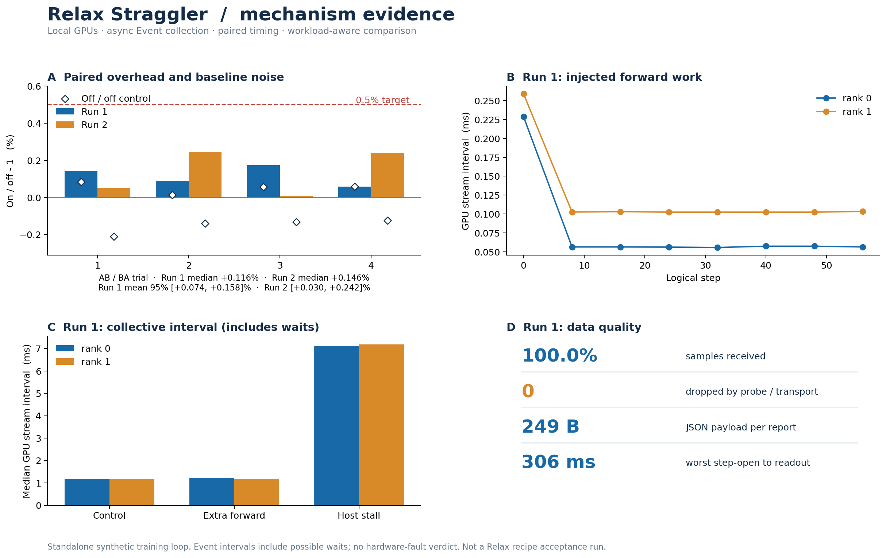
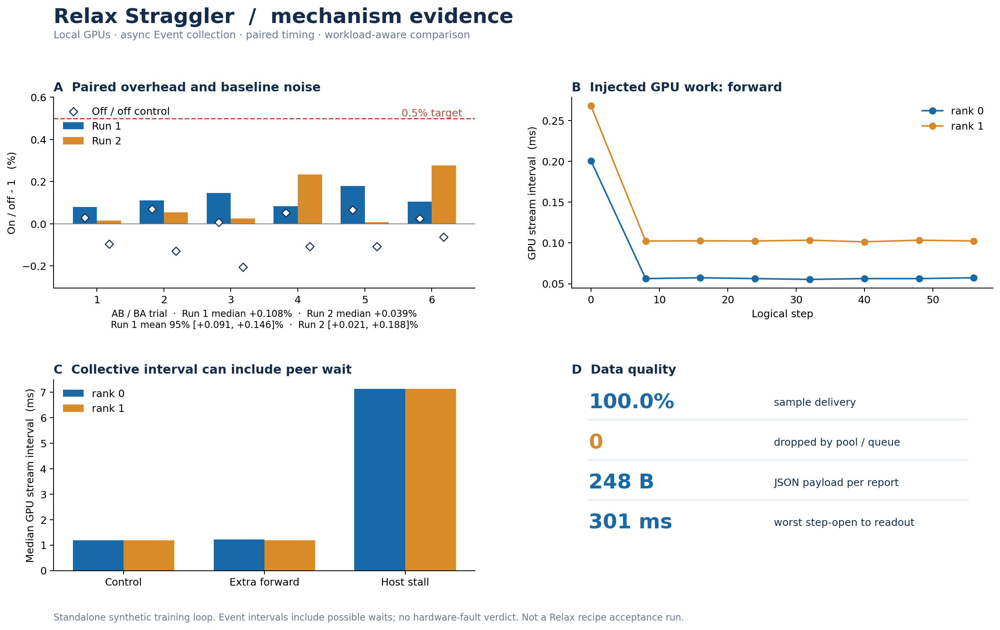
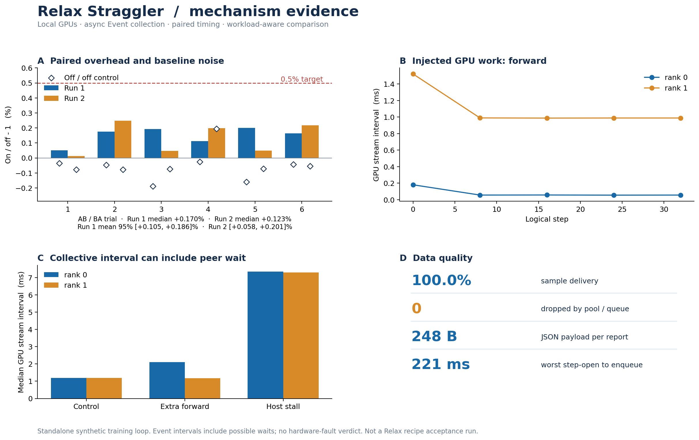
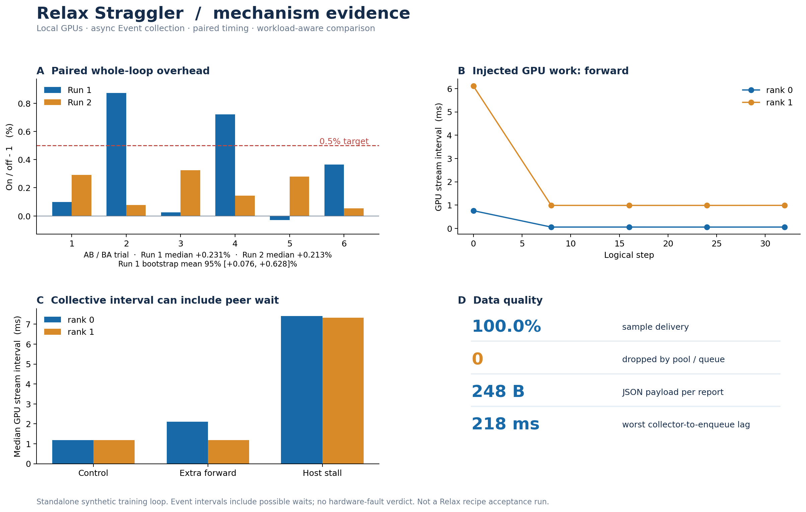

# Task 11 demo: measured results

The demo exercises the collection and diagnosis path proposed in [RFC #357](https://github.com/redai-studio/Relax/issues/357). It uses two local RTX 4090 GPUs with PyTorch 2.8.0+cu128, a small training loop, real gradient all-reduce, and a separate telemetry receiver. The measured source hashes and every raw sample are stored in the JSON files.

## Current replay demo

The [recovery run](results/2gpu-recovery-demo.json) uses the current source with one short off/on pair, one off/off pair and five 128-step diagnostic cases. It received 224/224 samples, had no collector or transport drops, and matched the off-run final parameters and loss. Rank 1's extra forward runs only in the middle half of one diagnostic case; the receiver reported a rank 1 forward alert at step 40. Measured forward intervals return to peer range at steps 96 and 104. The [interactive replay](results/2gpu-recovery-demo.html) shows those samples and labels the two-sample return as a derived observation, not an emitted resolution event. Its missing-peer switch removes one report only in a receiver-side counterfactual and reruns diagnosis. The host-stall case also produced a backward-stage alert at step 120; this cannot identify the root cause of the stall. The single timing pair measured **0.296%** overhead, which is a local observation rather than official acceptance. It does not measure MetricsService delivery latency or a Relax training recipe.



## Measured v4 snapshot

The figures below were measured with this [source snapshot](https://github.com/shanyulu/Relax/tree/7718e036c7144b68a01a8b608a4b463eb8e16ddd/demos/task11_straggler). The benchmark interleaves off/off controls with off/on pairs and hashes final model parameters outside the timed loop. The compute injection is one additional forward pass, about **1.8×** rather than the earlier ~17×. These numbers do not measure the later lifecycle fixes described below.

| Check                                        | Run A                            | Run B                            |
| -------------------------------------------- | -------------------------------- | -------------------------------- |
| Paired overhead, median                      | 0.116%                           | 0.146%                           |
| Bootstrap mean 95% interval                  | 0.074%–0.158%                    | 0.030%–0.242%                    |
| Interleaved off/off range                    | +0.014%–+0.084%                  | −0.211% to −0.124%               |
| Planned / received samples                   | 8,064 / 8,064                    | 8,064 / 8,064                    |
| Pool, queue, transport or collector drops    | 0                                | 0                                |
| Loss difference / final-parameter mismatches | 0 / 0                            | 0 / 0                            |
| Injected forward slowdown                    | rank 1, ~1.83×, alert at step 16 | rank 1, ~1.79×, alert at step 16 |

Both runs use 2× RTX 4090, PyTorch 2.8.0+cu128, four 8,000-step AB/BA pairs, four interleaved off/off pairs, and one sample every eight steps. [Run A](results/2gpu-v4-long-a.json) and [run B](results/2gpu-v4-long-b.json) contain every sample, pair, counter and measured source hash. The generated [rank × stage view](results/2gpu-v4-rank-view.md) reports each rank's median stage intervals, workload, coverage and finding. An Event interval cannot establish a hardware fault.

Each v4 trial lasts about 10.3–10.4 seconds. All four off/off differences in Run A are positive and all four in Run B are negative; the −0.211% control drift exceeds the reported median overhead. Increasing the step count has not demonstrated removal of systematic bias. The bootstrap interval resamples only four pairs within each run and does not account for this bias or between-run uncertainty. The demonstration has no real MetricsService transfer, PP/VPP schedule labels, attention/MoE hooks or overlap measurement.

## Lifecycle and report audit

The current source adds a close deadline that stops polling unfinished Events, counts abandoned samples and does not recycle their slots. After startup, background readout errors disable the collector; transport exceptions drop the affected sample. Startup and Event recording errors still propagate and are outside this tested isolation boundary.

Nineteen tests cover diagnosis, queue pressure, readout/transport exceptions, receiver replay with a stage mismatch, exit with an unfinished Event, unchanged model updates after a transport failure, and unknown data in the report. On 2026-09-24, the [current-source smoke run](results/2gpu-lifecycle-smoke.json) was regenerated from the exact public files at this revision. It received 144/144 samples, left no collector alive, and had zero paired parameter mismatches. Its single 256-step timing pair measured 0.321% overhead; one pair cannot supply an informative bootstrap interval or establish the official threshold. It also reported a backward-stage interval increase during a host stall, with cause `undetermined`. This checks execution and source traceability; it does not validate performance or root-cause accuracy. The v4 performance JSON and measured source snapshot remain unchanged.

## Multi-session mechanism check (2026-09-24)

Four fresh-process sessions on the same machine (4× RTX 4090, driver 595.71.05, torch 2.8.0+cu128), each with four off/on pairs and four off/off pairs at the v4 protocol (`--steps 8000 --interval 8 --batch 48 --dim 1024`, ~5 min 23 s per session). Each timed trial here lasted about 19.6–19.7 s versus 10.3–10.4 s in the v4 snapshot at the same step count, so the machine was in a different load state; overhead is a ratio and is not directly affected, but this difference belongs in any between-run drift discussion. Sessions A/B/C ran on GPUs 0,1; session D ran on GPUs 2,3. The current source adds a fifth observed case (`compute_recovery`) versus the v4 snapshot, so each session plans 8,080 samples. Raw JSON: [multisession-20260924](results/multisession-20260924/); the per-session `.log` files are kept only on the local machine and are not part of the repository.

| Session | GPUs | Pair overheads (%)            | Median (%) | Bootstrap mean 95% upper bound (%) | off/off range (%)      | Received |
| ------- | ---- | ----------------------------- | ---------- | ---------------------------------- | ---------------------- | -------- |
| A       | 0,1  | 0.4089 / −0.1176 / 0.2693 / −0.1215 | 0.0759 | 0.3391 | +0.1812 … +0.3308 | 8,080/8,080 |
| B       | 0,1  | −0.1119 / 0.2273 / −0.0324 / 0.0359 | 0.0017 | 0.1623 | −0.1792 … −0.0887 | 8,080/8,080 |
| C       | 0,1  | 0.4378 / 0.0267 / 0.0525 / 0.1197 | 0.0861 | 0.3415 | −0.1599 … +0.0560 | 8,080/8,080 |
| D       | 2,3  | 1.0346 / 0.2641 / −0.1105 / 0.2431 | 0.2536 | **0.8367** | −0.1894 … +0.1850 | 8,080/8,080 |

Pooled over all 16 pairs: median 0.0861%, mean 0.1641%. Every session median is below 0.5%, but session D fails the acceptance criterion that the bootstrap mean 95% upper bound also stay below 0.5%: its interval reaches 0.8367%. Sessions A/B/C stay below 0.5% at both the median and the upper bound. Every session received all planned samples with zero drops, zero loss differences and zero parameter mismatches.

### A/A control sessions (2026-09-24, added the same day)

The four sessions above were re-run with `--aa-pairs 4`: four additional pairs where **both arms run with the observer active** (`aa-session-A/B/C/D.json`, same protocol, 24,160/24,160 samples per session, zero drops, zero loss differences, zero parameter mismatches). The A/A difference isolates the observer's own timing bias from environment drift, which the off/off null pairs cannot:

| Measure | Pooled A/A (16 trials) | Pooled off/off null (16 trials) |
| --- | --- | --- |
| Median difference | +0.0135% | +0.2130% |
| Bootstrap mean 95% interval | −0.3332% to +0.1728% | −0.1894% to +3.0036% (one +3.00% outlier in session C) |
| Range | −1.3455% to +0.5510% | −0.6119% to +3.0036% |

Pooled paired overhead across all four A/A sessions (32 pairs): median +0.1844%, bootstrap mean 95% interval −0.0580% to +0.7061%. The A/A median being indistinguishable from zero while off/off pairs drift by tenths of a percent (and occasionally whole percents) supports the claim that the remaining spread is dominated by run-to-run environment drift rather than observer bias. It does **not** by itself bring the pooled overhead's upper bound below 0.5%; the acceptance plan (recipe runs, more pairs) stands.

What the spread says, honestly:

- Between-session drift is the same order as the measured effect: session medians span 0.0017%–0.2536%, and the A–D difference (0.178 pp) exceeds every session median except D's. A single-session number would have been luck, which is exactly why the acceptance plan demands ≥3 fresh sessions plus A/A controls.
- Session D (GPUs 2,3) has the highest median and contains the largest single pair (1.03%), but this experiment cannot attribute that difference to the GPU pair: A/B/C all ran on GPUs 0,1 and D ran last, so hardware pair and run order are fully confounded. Whether the 0.05 pp cross-pair tolerance holds is therefore untested by this design. Pairing and controls must stay within one hardware pair.
- The off/off sign flips between sessions (A all positive, B all negative, C/D mixed); the direction of the systematic bias is not stable. This confirms the v4 observation that control drift can exceed the median overhead.
- Detection behaviour was consistent across all four sessions: the injected extra-forward case alerted on rank 1 forward (first alert at step 8 in A/B/C, step 16 in D), the recovery case returned to peer range, the unequal-workload case was labelled `workload_imbalance` with no hardware verdict, host stall produced a backward-stage alert with cause `undetermined`, and the control case raised no alert. Sustained false-positive alerts during clean bench-on segments: 2/1/2/0 across A/B/C/D.

These are standalone-mechanism numbers on a toy training loop with real gradient all-reduce; they are not a Relax recipe result and do not measure MetricsService transfer, PP/VPP, multi-node behaviour or root-cause accuracy.

## Previous mechanism iteration (retained)

The preceding 2,400-step runs used a [different source revision](https://github.com/shanyulu/Relax/tree/caa87c051151af60bbf5a6d48535a2f19cf26f74/demos/task11_straggler) and are retained below.



| Check                       | Run A         | Run B              |
| --------------------------- | ------------- | ------------------ |
| Paired overhead, median     | 0.108%        | 0.039%             |
| Bootstrap mean 95% interval | 0.091%–0.146% | 0.021%–0.188%      |
| Interleaved off/off range   | 0.008%–0.069% | −0.205% to −0.062% |
| Planned / delivered samples | 3,664 / 3,664 | 3,664 / 3,664      |

[Run A](results/2gpu-v3-controlled-a.json), [run B](results/2gpu-v3-controlled-b.json) and the [smoke run](results/2gpu-diagnosis-v3-check.json) are retained for comparison. The smoke run produced a backward-stage alert during a host stall; its cause remained **undetermined**.



### First controlled follow-up

The short-run result below left a measurement question: one off/on pair exceeded 0.5%, but the trial lasted only about a second. We added an off/off negative control and repeated the original **every-eight-step, four-stage** probe with 2,400 steps per trial. Two independent runs used six AB/BA off/on pairs and six off/off pairs each, with the same measured source hashes and settings.

| Check                       | Run 1              | Run 2             |
| --------------------------- | ------------------ | ----------------- |
| Paired overhead, median     | 0.170%             | 0.123%            |
| Paired overhead, range      | 0.051%–0.200%      | 0.013%–0.248%     |
| Bootstrap mean 95% interval | 0.105%–0.186%      | 0.058%–0.201%     |
| Off/off control, range      | −0.188% to −0.027% | −0.078% to 0.195% |
| Delivered samples           | 3,640/3,640        | 3,640/3,640       |

Both runs had zero pool and queue drops and zero paired final-loss difference. The compute injection was located at rank 1 forward on sampled step 8; extra rank 0 collective time remained possible peer wait, not a network-fault verdict. [Run 1 raw data](results/2gpu-controlled-long-interval8.json) and [run 2 raw data](results/2gpu-controlled-long-interval8-replication.json) include every sample, pair, control and measured source hash. The short 800-step controlled run showed an off/off difference as large as **+0.673%** ([raw data](results/2gpu-controlled-interval8.json)); this is why its isolated threshold crossings cannot establish steady-state overhead.

The exploratory 800-step frequency sweep is retained in full: every-8-step [A](results/2gpu-interval8-prospective-a.json) / [B](results/2gpu-interval8-prospective-b.json), every-16-step [A](results/2gpu-interval16-prospective-a.json) / [B](results/2gpu-interval16-prospective-b.json), plus the [every-16-step controlled run](results/2gpu-controlled-interval16.json). The second every-16-step sweep still had a 0.819% pair and a 0.534% bootstrap upper bound; halving sampling frequency was not a reliable fix.

The frequency sweep and initial short trials used the [first source snapshot](https://github.com/shanyulu/Relax/tree/fb5eb18830dab2f1fb885f73b2205e8941bd5644/demos/task11_straggler). The earlier controlled runs used the [second source snapshot](https://github.com/shanyulu/Relax/tree/2469202743013b835c989d1d920a409922c2845c/demos/task11_straggler). Each result records its own measured source hashes.

These two earlier longer runs support a lower-noise **local mechanism** measurement, not official acceptance. The per-run bootstrap intervals condition on six pairs in one session and do not cover other hardware, recipes or reporting stacks. Probe initialization is before the timed loop and measured separately; on-run synchronization and collector close remain included. Reporting lag is measured from sampled step opening to collector readout, not from Event completion and not through a platform receiver.

## Initial short trials (retained)



| Check                     | Observation                                                                                                                                                                                    |
| ------------------------- | ---------------------------------------------------------------------------------------------------------------------------------------------------------------------------------------------- |
| Paired overhead, run 1    | Six 800-step pairs, alternating off/on order: median **0.231%**; individual pairs **−0.029% to 0.872%**; bootstrap mean 95% interval **0.076%–0.628%**. Two pairs exceeded 0.5%.               |
| Paired overhead, run 2    | Same code and settings: median **0.213%**; individual pairs **0.055%–0.324%**; bootstrap mean 95% interval **0.111%–0.276%**.                                                                  |
| Loss                      | Per-pair on/off final loss difference was **0** in both runs.                                                                                                                                  |
| Collection                | **1240/1240** planned samples delivered in each run; no pool or queue drops. Run 1 JSON payload: **307,025 bytes**, about **248 bytes/report**.                                                |
| Injected compute slowdown | Rank 1 forward was approximately **0.986 ms** vs **0.056 ms** on rank 0; persistent alert at sampled step 8. Rank 0's concurrent collective interval was classified as **possible peer wait**. |
| Unequal workload          | The rank with twice the batch size was marked **workload imbalance**, not a hardware fault.                                                                                                    |
| Host stall                | Both ranks showed an approximately **7.3 ms** collective interval; there was no rank-specific hardware verdict.                                                                                |
| Four-GPU check            | **364/364** samples delivered, no drops; rank 1 forward slowdown found. This is a single-node check.                                                                                           |

The figure places both 2-GPU runs side by side. Both use the same benchmark and diagnosis source hashes and the same configuration. Raw evidence: [run 1](results/2gpu-final.json), [run 2](results/2gpu-replication.json), [four-GPU check](results/4gpu-smoke.json).

## What the numbers do not establish

The initial two-run result does **not** establish the official \<0.5% target. The first run's upper confidence bound exceeds 0.5%, and this is a standalone training loop, not a Relax recipe. The bootstrap interval reflects only the six pairs within each local run; it does not cover hardware or workload diversity. The observed maximum sampled-step-open-to-readout lag was about 218 ms in run 1. It excludes receiver-side analysis time. JSON payload byte counts exclude multiprocessing framing and any future network protocol. Timed loops include collector readout and enqueue, while the queue feeder may flush after insertion.

The demo does not verify PP/VPP identity, attention/MoE hooks, real MetricsService integration, overlap preservation in a Relax recipe, or multi-node behavior. Those remain separate implementation and acceptance work. An Event interval around a collective may include waiting for a peer; this experiment deliberately retains that ambiguity.

## Reproduce

Current-source smoke check and report (run from this directory):

```bash
python -m unittest -v test_diagnosis.py test_probe.py test_rank_view.py test_replay.py
python run_demo.py --gpus 2 --pairs 1 --null-pairs 1 --steps 256 --injection-steps 64 --warmup 12 --interval 8 --batch 48 --dim 1024 --output results/reproduction.json
python render_report.py results/reproduction.json --output results/reproduction.png
python render_rank_view.py results/reproduction.json --markdown results/reproduction.md
```

To repeat the v4 performance experiment, use its pinned source snapshot, set `--pairs 4 --null-pairs 4 --steps 8000`, keep the other settings above, and run twice with different output paths.

The code and data are public review artifacts on a fork branch. The demo changes no Relax production path.
