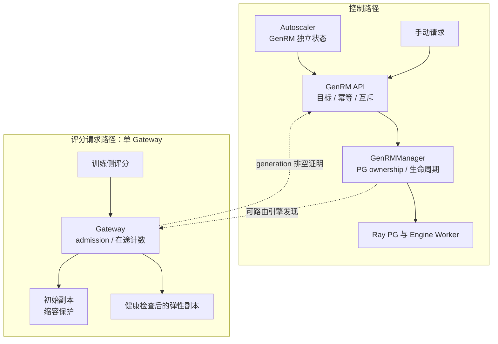
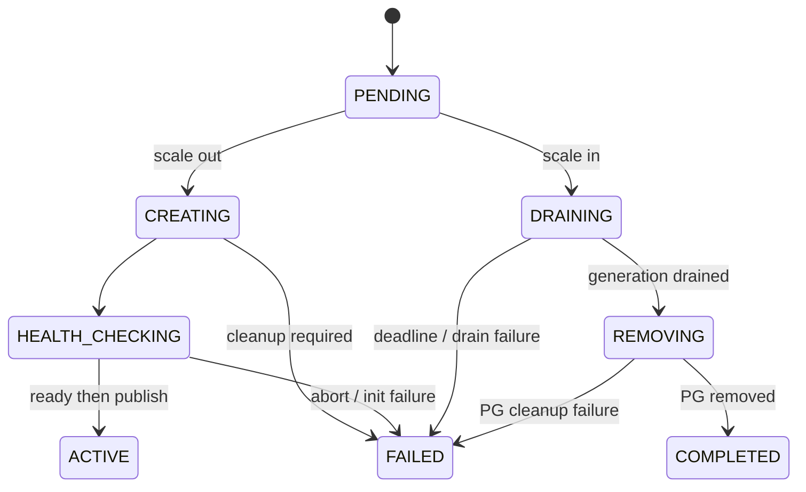

# 【No.4】GenRM 弹性扩缩容设计（RFC）

提案人：@shanyulu · 导师：@RexFlux · 实现：[PR #370](https://github.com/redai-studio/Relax/pull/370) · [API 契约](https://github.com/redai-studio/Relax/blob/da4acbbab530f082f37c1633c811c704be5a044e/docs/zh/api/genrm.md)

## 要解决的问题

GenRM 当前副本随服务启动固定。负载变化时，训练侧需要在不改评分接口、不重建初始引擎的前提下增减冻结模型副本，并确认缩容请求不会切断已接收的评分请求，也不会在 API 返回后遗留 Ray placement group（PG）或 GPU 资源。

[官方 Task 4](https://github.com/redai-studio/community/blob/main/contributor-program/2026-cohort-2/official-task.md#task-4)要求覆盖 Manager 生命周期、控制接口、Autoscaler 与真实训练验证。本提案把生命周期、路由和证据边界分开说明；单 Gateway 验证不代表 direct client 或跨 Gateway 已具备完整排空语义。

| 当前状态   | 结果                                                                                    |
| ---------- | --------------------------------------------------------------------------------------- |
| 产品       | `0481701`；PR #370 当前头 `da4acbb`，产品代码未在该文档头之后变更                       |
| CI         | `da4acbb` 上 8 项必需检查成功；PR 尚待维护者批准                                        |
| 已验证范围 | 单 Gateway、单 GPU 弹性副本；手动扩缩、按负载自动扩缩、失败收尾、评分对照与训练运行记录 |
| 待裁决     | artifact 归属、验收规模、内容确定性采样语义                                             |

## 架构与责任边界

GenRM API 负责请求、幂等记录和排空证明；Manager 负责 Ray 资源与引擎生命周期；Autoscaler 负责按服务采集和决策。API 超时不等于物理任务停止，也不代表资源已释放。

| 组件                 | 负责                                                         | 当前边界                                                   |
| -------------------- | ------------------------------------------------------------ | ---------------------------------------------------------- |
| GenRM API / Registry | 绝对目标、幂等重放、状态查询、admission 与请求计数           | 幂等历史为有界内存状态，不承诺组件重启后的持久重放         |
| GenRMManager         | PG owner 登记、候选创建、健康检查、发布、移除与 reconcile    | 不新建公开 ingress；不承诺 Manager 重启后恢复在途操作      |
| Autoscaler           | 独立服务上下文、有效指标、扩缩条件、冷却与历史               | 自动 GenRM target 限定单模型实例；多实例发现时拒绝混合决策 |
| DrainTracker 适配    | 关闭本 Gateway admission，并按 generation 等待已接收请求归零 | 未覆盖 direct client 或跨 Gateway 的统一 lease             |

## 生命周期与失败语义

扩容先创建并初始化候选，健康检查成功后才加入路由。缩容固定 victim，先关闭 admission，再等待该 generation 的在途请求归零，随后退役 worker 并确认其 owned PG 为 `REMOVED`。初始副本不能被缩掉；退役的弹性槽位不会被通用 `recover()` 重建。

`FAILED` 描述操作结果，`cleanup_required` 描述资源清理是否完成。超时只发送 abort；物理任务未结束或 PG 未确认移除时，同模型互斥继续保留。此设计用可用性换取不并发破坏资源状态；reconcile 只清理原操作，不把 `FAILED` 改写成成功。

容量分别呈现 `current`、`ready`、`occupied` 和 `pending_cleanup`：未发布候选不计入可服务容量；未释放的失败缩容 victim 仍计入服务与资源占用。Ray placement-group 表中的 `REMOVED` 墓碑不计作活动资源；验收结合 PG 终态和 GPU 显存回归。

控制 API 使用绝对总副本目标。提交成功仅表示请求被接收；调用方通过 `request_id` 查询终态。相同幂等 key 与请求指纹重放原操作，指纹不同返回冲突；目标已满足时返回 `NOOP`。无权威 Manager 状态时拒绝决策，不用降级快照替代资源证明。字段和错误码见 [API 文档](https://github.com/redai-studio/Relax/blob/da4acbbab530f082f37c1633c811c704be5a044e/docs/zh/api/genrm.md)及 [OpenAPI](https://github.com/redai-studio/Relax/blob/da4acbbab530f082f37c1633c811c704be5a044e/docs/public/openapi/genrm.json)。

## Autoscaler 与评分契约

Rollout 与 GenRM 共用一个 Autoscaler deployment，但各自拥有 engine discovery、metrics collector、decision engine、pending operation 与 history。每个条件只使用所需字段的有效样本；缺失、过期或零样本不填成零。缩容要求活跃引擎具备必要字段的有效证据。状态、条件、历史和 TUI 按 service 展示，旧 Rollout 默认字段与视图保留。

温度采样且未显式给出 `sampling_seed` 时，当前 GenRM 依据模型、实际输入 token 与有效采样参数派生稳定 seed；显式 seed 优先。此行为意味着相同内容的独立重复请求复用随机流，属于需要维护者确认的产品语义。固定样本测试未观察到翻转，只能支持该测试范围内的新旧副本一致性，不证明通用判题准确率或所有负载下的普遍保证。

## 验收证据

原始 Task 4 运行记录固定于 [evidence commit `fdf288d`](https://github.com/shanyulu/Relax/tree/fdf288d705ddbefa7f8de9fbad050f7ed3ac4f27/demos/task4_genrm/results/)。不同验收运行使用不同产品提交，表中按各自实际版本报告。

| 项目         | 运行版本  | 结果                                                                              | 证据与边界                                                                                                                                                                                               |
| ------------ | --------- | --------------------------------------------------------------------------------- | -------------------------------------------------------------------------------------------------------------------------------------------------------------------------------------------------------- |
| 手动扩缩     | `a2ca6cb` | 1→2→1；4,163 请求零失败；初始引擎保留、资源回归                                   | [运行记录](https://github.com/shanyulu/Relax/tree/fdf288d705ddbefa7f8de9fbad050f7ed3ac4f27/demos/task4_genrm/results/e2e_run_20260924)；单 Gateway、单 GPU 副本                                          |
| 评分对照     | `0481701` | 50 个输入、800 条归属回复；greedy 一致，采样 0/50 翻转                            | [最终代码复确认](https://github.com/shanyulu/Relax/tree/fdf288d705ddbefa7f8de9fbad050f7ed3ac4f27/demos/task4_genrm/results/reward_consistency_20260927_final_r6)；不是模型准确率验收                     |
| 请求历史扰动 | `0481701` | 先对初始引擎额外采样 300 次；再比较 50 个输入、400 条回复，0/50 翻转              | [对照记录](https://github.com/shanyulu/Relax/tree/fdf288d705ddbefa7f8de9fbad050f7ed3ac4f27/demos/task4_genrm/results/sampling_divergence_20260927_final_r4)                                              |
| 控制契约     | `0481701` | 278 项任务相关 CPU 回归通过                                                       | [EVIDENCE](https://github.com/redai-studio/Relax/blob/da4acbbab530f082f37c1633c811c704be5a044e/demos/task4_genrm/EVIDENCE.md#L9)；覆盖幂等、409、非法目标和初始副本保护                                  |
| 自动扩缩     | `5c1e2e7` | 冻结断言 14/14；1,568 请求零失败；弹性副本处理 181 请求；真空闲缩容与资源回收通过 | [最终轮](https://github.com/shanyulu/Relax/tree/fdf288d705ddbefa7f8de9fbad050f7ed3ac4f27/demos/task4_genrm/results/autoscaler_prereg_v2_20260926_final_r3)                                               |
| 故障收尾     | `e7224af` | 长请求排空、deadline abort 后互斥与 reconcile、kill-victim 场景通过               | [故障注入](https://github.com/shanyulu/Relax/tree/fdf288d705ddbefa7f8de9fbad050f7ed3ac4f27/demos/task4_genrm/results/failure_injection_20260925_r2)；失败恢复可延迟，不是延迟 SLA                        |
| 训练继续完成 | `945741e` | 8/8 step 与 rollout 完成；日志记录 64 个保存样本                                  | [再分析 v2.1](https://github.com/shanyulu/Relax/blob/fdf288d705ddbefa7f8de9fbad050f7ed3ac4f27/demos/task4_genrm/results/train_continuity_20260925_r5/REANALYSIS_V2.md)；不证明逐样本内容去重或零性能影响 |

训练日志的最大 step-start 间隔约 75 秒，跨过扩容边界；step-end 间隔约 29 秒，跨过缩容边界。它们既不能证明扩缩导致停顿，也不能证明没有性能影响。缩容窗口约 1 秒且窗口内无训练事件；该轮弹性副本仅有一个计数器归属请求。旧索引中“全程零错误”和“全程停顿不超过 120 秒”已撤回；64 个样本依据是保存日志，未保留逐样本 JSONL 作内容核验。

截图来自冻结自动扩缩轮，用于审查界面，不替代整轮事件记录和 verdict。

## 请维护者裁决

1. **Artifact 归属**：哪些 driver、manifest 和原始 evidence 留在 Relax 仓库，哪些迁到独立 evidence 分支？
2. **验收规模**：是否接受 4×RTX 4090、Qwen3-0.6B、单 GPU 弹性副本作为本期生命周期与路由验收？如需其他规模，请给出判据。
3. **采样语义**：是否接受未显式指定 seed 时按内容派生 seed、使相同内容重复调用复用随机流？如需随机多样性，请定义请求身份/seed 契约。

跨 Gateway 或 direct-client 的统一排空、Manager 重启恢复、多 GPU 弹性副本、弹性操作与运行时 onload/offload 协调均未在本期验收范围内。相关实现与现有证据见 [PR #370](https://github.com/redai-studio/Relax/pull/370)。
