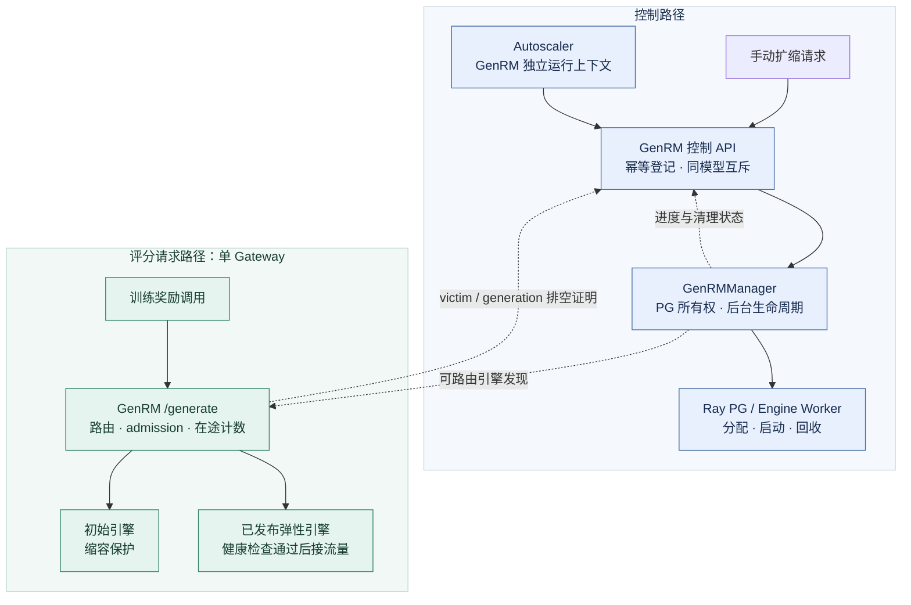
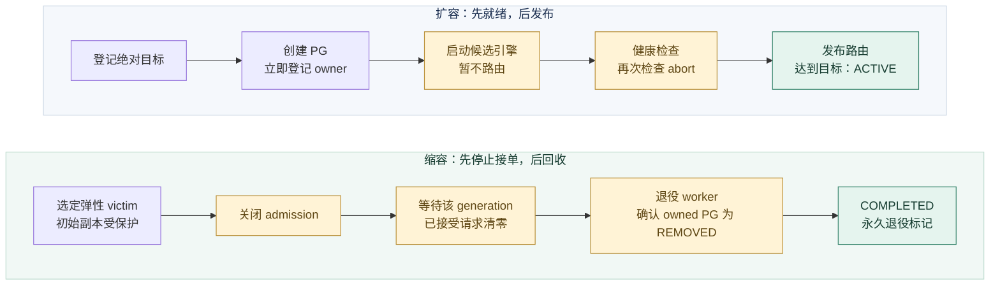
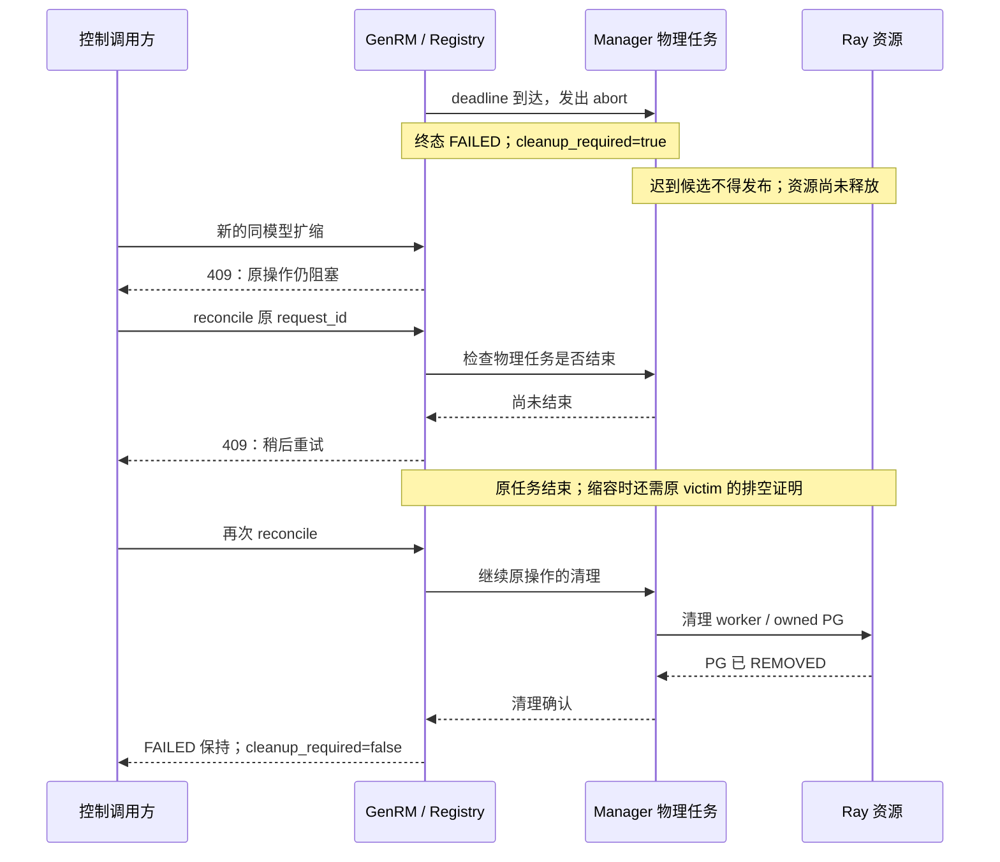

提案人：@shanyulu · 导师：@RexFlux · 实现：[PR #370](https://github.com/redai-studio/Relax/pull/370) · [API 契约](https://github.com/redai-studio/Relax/blob/da4acbbab530f082f37c1633c811c704be5a044e/docs/zh/api/genrm.md)

## 1. 目标与范围

为冻结奖励模型 GenRM 增加动态副本管理：负载升高时加入新引擎，负载回落时排空并回收弹性副本，训练侧继续使用原有评分接口。新副本从冻结模型启动，扩缩路径不做训练权重同步；训练原有的 actor→rollout 权重同步保持不变。

[官方 Task 4](https://github.com/redai-studio/community/blob/main/contributor-program/2026-cohort-2/official-task.md#task-4)要求 Manager 生命周期、控制接口、Autoscaler 和真实训练验证。本提案分别在下文给出实现边界与验收证据。

| 当前状态   | 说明                                                                                                                                                                                                                                                     |
| ---------- | -------------------------------------------------------------------------------------------------------------------------------------------------------------------------------------------------------------------------------------------------------- |
| 代码与 CI  | 产品 [0481701](https://github.com/shanyulu/Relax/commit/048170127f3ef4a7ea6255b5e5e01240b03876bc)；PR 头 [da4acbb](https://github.com/redai-studio/Relax/commit/da4acbbab530f082f37c1633c811c704be5a044e)，`relax/` 产品代码保持不变；当前头 CI 8/8 通过 |
| 已实现范围 | 单 Gateway 排空；单 GPU 弹性副本；手动扩缩；Rollout/GenRM 分服务自动决策                                                                                                                                                                                 |
| 依赖边界   | 使用私有 DrainTracker 适配接口；未提供跨 Gateway 或直连引擎客户端的完整 admission lease                                                                                                                                                                  |
| 合入条件   | 当前头 review，以及 artifacts 归属、验收规模、采样语义三项裁决                                                                                                                                                                                           |

## 2. 架构：请求路径与控制路径分开

GenRM 组件负责请求入口、幂等记录和排空证明；Manager 负责物理资源与引擎生命周期。HTTP 操作结束，不等于 Ray 资源已经释放，二者通过进度与清理状态关联。

图中实线表示调用，虚线表示发现、状态或观测关系；这是组件职责图，不表示所有关系都使用同一传输协议。

| 层                    | 负责                                                    | 不负责                                 |
| --------------------- | ------------------------------------------------------- | -------------------------------------- |
| GenRM 组件 / Registry | 校验目标、幂等重放、状态查询、请求 admission 与在途计数 | 不把 HTTP 超时当作 worker 已停止       |
| GenRMManager          | PG ownership、候选初始化、健康检查、发布与回收          | 不创建第二套公共推理入口               |
| Autoscaler            | 分服务采集、指标有效性、持续条件、冷却、操作跟踪        | 不绕过控制接口直接增删引擎             |
| Task 3 接口边界       | 将来对接统一 Manager / ingress；私有适配点需要共同确认  | 本 PR 不宣称已实现 Task 3 的跨入口排空 |

源码入口：[GenRM 组件](https://github.com/redai-studio/Relax/blob/a55c85f83439a5680cef7dc18a54dc4eee9d668d/relax/components/genrm.py)、[Manager](https://github.com/redai-studio/Relax/blob/a55c85f83439a5680cef7dc18a54dc4eee9d668d/relax/distributed/ray/genrm.py)、[操作 Registry](https://github.com/redai-studio/Relax/blob/a55c85f83439a5680cef7dc18a54dc4eee9d668d/relax/utils/genrm_scale_registry.py)。

## 3. 生命周期与控制契约

### 正常扩缩

扩容按副本逐个推进；首个失败停止继续创建，保留已经发布的副本。缩容优先选择较新的弹性副本；一旦进入排空，清理和 reconcile 都绑定该 victim，不另选一个替代它。成功删除的弹性槽位永久退役，通用 `recover()` 不会把它重建回来。

| 操作 | 正常状态链                                              | 失败结果                                                  |
| ---- | ------------------------------------------------------- | --------------------------------------------------------- |
| 扩容 | `PENDING → CREATING → HEALTH_CHECKING → READY → ACTIVE` | 未发布新副本为 `FAILED`；已发布部分副本后失败为 `PARTIAL` |
| 缩容 | `PENDING → DRAINING → REMOVING → COMPLETED`             | `FAILED`；是否仍占用资源另看清理状态                      |

状态链是契约，不保证轮询能观察到每个中间状态。`PARTIAL` 不表示达到目标；应同时检查容量、创建数量及 `cleanup_required`。GenRM 不进入 `WEIGHT_SYNCING`。

| 请求规则       | 行为                                                                                     |
| -------------- | ---------------------------------------------------------------------------------------- |
| 目标           | `num_replicas` 是目标绝对总数，不是增量；不允许缩掉初始副本                              |
| 受理           | 返回 `PENDING + request_id`，之后按 ID 查询；HTTP 200 不表示扩缩完成                     |
| 重放           | 相同方向、key 与 `(model_name, num_replicas, timeout_secs)` 重放原操作；指纹不同返回 409 |
| 已满足目标     | 返回 `NOOP`，没有操作 ID；带 key 的重放保留最初决定                                      |
| 冲突与无效请求 | 同模型在途操作或待清理操作阻止新扩缩；非法目标返回明确 4xx                               |
| 无权威状态     | Manager / 容量不可用时拒绝扩缩，不能用降级显示值作决策                                   |

`POST /genrm/scale_out` 与 `/scale_in` 提交目标；对应的 `GET /{方向}/{request_id}` 查询状态，`POST /{方向}/{request_id}/reconcile` 重试清理；`GET /genrm/engines` 查询引擎与容量。完整字段、错误码见 [API 文档](https://github.com/redai-studio/Relax/blob/da4acbbab530f082f37c1633c811c704be5a044e/docs/zh/api/genrm.md)及 [OpenAPI](https://github.com/redai-studio/Relax/blob/da4acbbab530f082f37c1633c811c704be5a044e/docs/public/openapi/genrm.json)。

幂等记录是有界内存历史，不提供组件重启后的持久重放；Manager 重启后的在途恢复也不在本期范围。

## 4. 超时与容量：失败不能提前释放互斥

超时只发出 abort。尚未结束的初始化可能迟到，Ray 的 PG 删除也可能尚未完成；此时允许新操作，会使同一模型同时创建、排空和回收资源。因此选择保留互斥，代价是故障后的可用性恢复可能晚于请求 deadline。

下面以一次已超时、仍待清理的操作为例：

reconcile 不是“重试一遍扩缩”，而是收尾同一操作。资源清理失败继续阻止新操作；若无法取得原操作证明，不按成功处理。

容量不能只报一个 `num_engines`。以下是“一个初始副本，加一个弹性副本”的典型稳定快照；不代表每个初始化瞬间都具备相同数值。

| 阶段                               | `current` 已发布容量 | `ready` 可路由 | `occupied` 占用槽位 | `pending_cleanup` 待清理 |
| ---------------------------------- | -------------------: | -------------: | ------------------: | -----------------------: |
| 只有初始副本                       |                    1 |              1 |                   1 |                        0 |
| 候选 worker 已创建，未发布         |                    1 |              1 |                   2 |                        0 |
| 新副本已发布                       |                    2 |              2 |                   2 |                        0 |
| 弹性副本排空中                     |                    2 |              1 |                   2 |                        0 |
| 缩容 victim 已退役，但 PG 回收失败 |                    2 |              1 |                   2 |                        1 |
| 未发布候选失败，PG 待清理          |                    1 |              1 |                   2 |                        1 |
| 清理完成，回到初始容量             |                    1 |              1 |                   1 |                        0 |

`current` 保留未释放的失败缩容 victim，不能拿它当作可服务副本数。`/metrics` 与 `/engines` 的降级快照也不是资源释放证明。验收同时检查 PG 终态和 GPU 回归；PG 数量只统计非 `REMOVED` 记录，Ray 保留的历史墓碑不等于泄漏。

## 5. Autoscaler：共享部署，分开运行状态

同一个 Autoscaler deployment 为 Rollout、GenRM 各维护一套 engine discovery、指标采集、决策、持续条件、冷却、在途操作和历史；`service_policies` 进入实际决策器。冷却时长的配置值仍由 deployment 提供。`/status`、`/conditions`、`/scale_history`、`/metrics_history` 与 TUI 提供对应服务视图，旧 Rollout 顶层字段和默认 TUI 视图保留。

| 观测情况        | 决策约束                                                                                    |
| --------------- | ------------------------------------------------------------------------------------------- |
| 扩容条件        | 每个条件只用自己所需字段的有效证据与分母；满足持续时间的正向负载信号才能触发                |
| 缩容条件        | 必要字段必须覆盖活跃引擎，且所有缩容条件持续满足；缺失或过期数据不能补成零                  |
| 无请求 / 新副本 | 真实观测到的零 gauge 与未观测区分；无样本直方图不是有效延迟证据，也不能等同整个引擎不可判断 |
| 无法作出决策    | 在 conditions 中暴露字段有效性、覆盖与阻塞原因，TUI 展示对应服务状态                        |

当前自动扩缩的 GenRM target 限定为单模型实例；发现多个活跃实例时拒绝混合处理。手动 API 的多实例选择能力不代表已经实现多模型独立 Autoscaler。

图：冻结协议最终轮留档的 GenRM TUI 快照，不是设计稿。截图用于核对服务选择与可观测性；整轮结果以 [verdicts 和事件记录](https://github.com/shanyulu/Relax/tree/fdf288d705ddbefa7f8de9fbad050f7ed3ac4f27/demos/task4_genrm/results/autoscaler_prereg_v2_20260926_final_r3)为准。实现见 [AutoscalerService](https://github.com/redai-studio/Relax/blob/a55c85f83439a5680cef7dc18a54dc4eee9d668d/relax/utils/autoscaler/autoscaler_service.py)与 [指标采集器](https://github.com/redai-studio/Relax/blob/a55c85f83439a5680cef7dc18a54dc4eee9d668d/relax/utils/autoscaler/metrics_collector.py)。

## 6. 评分一致性是一项产品契约

“相同权重”不足以保证采样结果相同：两台引擎的请求历史不同，随机状态也可能不同。当前实现对 `temperature > 0` 且未提供 `sampling_seed` 的请求，从模型标识、实际 token 输入及有效采样参数派生 seed；显式 seed 保留，greedy 请求不注入 seed。

这意味着同内容的重复请求也受确定性约束，改变了默认随机性，需要维护者明确接受。当前引擎启用相应确定性路径；不支持的随机 `min_p` 组合及不明确的 `temperature` 会在入口拒绝，不能静默改变语义。

验收比较的是**初始与弹性引擎的完整 judge 判定**，不是短生成前缀，也不是奖励模型相对标注的准确率。有限样本未发现翻转，不推出跨硬件、任意并发或所有输入下的普遍保证。

## 7. 验收证据与结论边界

各实验的运行版本与复核入口见下表，原始数据固定于 evidence `fdf288d`。

| 官方验收项         | 运行版本  | 结果与复核入口                                                                                                                                                                                                                                                                                                                                                                                    | 能支持的结论                                                      |
| ------------------ | --------- | ------------------------------------------------------------------------------------------------------------------------------------------------------------------------------------------------------------------------------------------------------------------------------------------------------------------------------------------------------------------------------------------------- | ----------------------------------------------------------------- |
| ① 手动扩缩与回收   | `a2ca6cb` | [1→2→1，4,163 请求零失败](https://github.com/shanyulu/Relax/tree/fdf288d705ddbefa7f8de9fbad050f7ed3ac4f27/demos/task4_genrm/results/e2e_run_20260924)；初始引擎保留，资源回归                                                                                                                                                                                                                     | 该单 Gateway / 单 GPU 副本运行的生命周期                          |
| ② 新旧副本评分一致 | `0481701` | [50 输入、800 条归属回复](https://github.com/shanyulu/Relax/tree/fdf288d705ddbefa7f8de9fbad050f7ed3ac4f27/demos/task4_genrm/results/reward_consistency_20260927_final_r6)；greedy 一致，采样 0/50 翻转；[历史扰动对照](https://github.com/shanyulu/Relax/tree/fdf288d705ddbefa7f8de9fbad050f7ed3ac4f27/demos/task4_genrm/results/sampling_divergence_20260927_final_r4)另有 400 条回复、0/50 翻转 | 完整、可解析判定的跨副本一致性；GenRM 扩缩路径无权重同步          |
| ③ 幂等与控制边界   | `0481701` | [278 项任务相关 CPU 回归](https://github.com/redai-studio/Relax/blob/a55c85f83439a5680cef7dc18a54dc4eee9d668d/demos/task4_genrm/EVIDENCE.md#L9)；幂等、409、非法目标、初始保护                                                                                                                                                                                                                    | 控制协议和失败分支，不替代 GPU 资源验证                           |
| ④ 自动扩缩与观测   | `5c1e2e7` | [冻结协议最终轮 14/14](https://github.com/shanyulu/Relax/tree/fdf288d705ddbefa7f8de9fbad050f7ed3ac4f27/demos/task4_genrm/results/autoscaler_prereg_v2_20260926_final_r3)；1,568 请求零失败，弹性副本处理 181 请求；包含真实空闲轮与双服务截图                                                                                                                                                     | 冻结负载和配置下的自动扩缩；早期失败轮保留                        |
| ⑤ 训练继续完成     | `945741e` | [原始日志与机器生成再分析](https://github.com/shanyulu/Relax/tree/fdf288d705ddbefa7f8de9fbad050f7ed3ac4f27/demos/task4_genrm/results/train_continuity_20260925_r5)；8/8 步执行完成、8/8 rollout 完成；日志记录 64 个保存样本，rollout ID 无缺漏或重复                                                                                                                                             | 运行完成；扩容窗有 rollout 进展。未证明逐样本内容去重或零性能影响 |
| 补充：故障收尾     | `e7224af` | [长请求排空、deadline-abort/reconcile、kill-victim](https://github.com/shanyulu/Relax/tree/fdf288d705ddbefa7f8de9fbad050f7ed3ac4f27/demos/task4_genrm/results/failure_injection_20260925_r2)通过；超时后保留互斥约 607.2 秒，再清理                                                                                                                                                               | 验证失败后不提前放行；不是低恢复延迟承诺                          |

训练证据以[再分析 v2.1](https://github.com/shanyulu/Relax/blob/fdf288d705ddbefa7f8de9fbad050f7ed3ac4f27/demos/task4_genrm/results/train_continuity_20260925_r5/REANALYSIS_V2.md)为准。75 秒的 step-start 最大间隔跨过扩容窗，29 秒的 step-end 间隔跨过缩容边界；这既不能证明扩缩导致停顿，也不能证明没有影响。缩容窗仅约 1 秒，窗内无训练事件；弹性引擎的训练贡献仅有一个计数器归属请求。逐样本 JSONL 未保留，64 的依据是保存日志，不是文件级内容核验。

仓库旧索引的“全程零错误”和“全程停顿不超过 120 秒”表述已撤回。原始日志有三条非良性带时间戳错误记录；judge 错误行数与双副本稳定窗口内的错误行数均为 0。连续事件间隔不覆盖首个事件前或最后事件后的时间，不能推导全程停顿上界。

当前头的 8 项 CI 包含 pre-commit、Python 3.10/3.11/3.12、H20 4-GPU 单测及三项训练集成（其中一项为 NPU）。它们提供回归覆盖，不替代上表的专用验收实验。

## 8. 待维护者决定

| 决策          | 当前方案                                                  | 需要确认                                               |
| ------------- | --------------------------------------------------------- | ------------------------------------------------------ |
| artifact 归属 | PR 内提供 driver / 索引，原始运行另有不可变 evidence 分支 | 哪些文件应保留在主仓库，哪些应迁出                     |
| 验收规模      | 4×RTX 4090、Qwen3-0.6B；单 GPU 弹性副本                   | 是否足以验收本期生命周期与路由，是否另需指定规模       |
| 采样语义      | 默认内容派生 seed，显式 seed 优先                         | 是否接受重复同内容请求的确定性，或要求另设评分请求身份 |

跨 Gateway / direct-client 排空、Manager 重启恢复、多 GPU 弹性副本，以及弹性操作与运行时 onload/offload 的协调，不在本期承诺内。上述边界不因实验通过而自动扩大。

相关入口：[PR #370](https://github.com/redai-studio/Relax/pull/370) · [中文 API](https://github.com/redai-studio/Relax/blob/da4acbbab530f082f37c1633c811c704be5a044e/docs/zh/api/genrm.md) · [不可变原始证据](https://github.com/shanyulu/Relax/tree/fdf288d705ddbefa7f8de9fbad050f7ed3ac4f27/demos/task4_genrm/results/)
