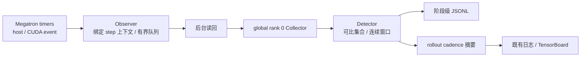
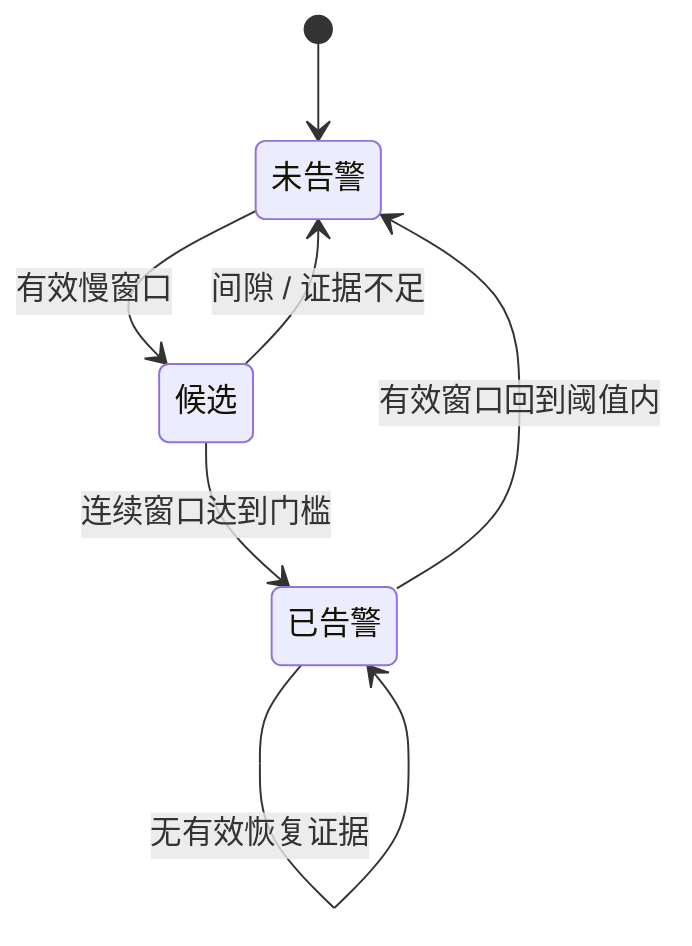

# 【No.11】训练慢卡诊断与平台上报设计（RFC）

提案人：@shanyulu · 导师：@Lemon-412 · 实现：[Draft PR #378](https://github.com/redai-studio/Relax/pull/378)

## 要回答的问题

训练变慢时，系统需要指出哪个 rank、哪个训练阶段持续偏离可比同伴，并把诊断送入现有训练日志和平台。结论必须区分观测事实、判定结果与根因推测：host/CUDA stream 区间可以定位延迟，不能单独证明是硬件、网络或算子故障。

[官方 Task 11](https://github.com/redai-studio/community/blob/main/contributor-program/2026-cohort-2/official-task.md#task-11)要求整体开销低于 0.5%、真实训练不影响精度/loss/通算重叠，以及通过平台定位慢卡。本 RFC 的配对设计、置信区间和门槛是本提案的验收方法；导师尚未确定 C1 主指标，不能把 pilot 当成官方通过。

| 当前状态 | 结论                                                                                                           |
| -------- | -------------------------------------------------------------------------------------------------------------- |
| 公开 PR  | #378 当前头 `c2875a5`，Draft；当前 CI 8/8 通过，代码评审待进行                                                 |
| 产品版本 | `927c5de`；当前 PR 头仅有 Python 3.10 测试竞态修复，`relax/` 零变更                                            |
| C1       | 旧版 6 对 pilot 为 `INCONCLUSIVE`；均值 +0.417%，95% bootstrap CI 上界 +2.023%                                 |
| C2       | a48a23b 旧 loss/grad 保持 `UNSCORED`；927c5de 参数、overlap、loss/grad 为独立证据，不能合并成一个未限定的 PASS |
| C3       | 阶段级 JSONL 与 rollout 级平台确认均有证据；实时口径待维护者裁决，逐事件时延 `UNMEASURED`                      |
| 范围待决 | C1 主指标、rollout cadence 是否满足实时、Attention/MoE schema-only 是否接受                                    |

## 数据路径

Collector 在 global rank 0 训练进程内，不是独立服务。跨 rank 聚合需要配置共享 collector 地址；否则各 rank 只能本地汇总。CUDA event 反映流上可观察区间，可能包含等待；它不是纯 kernel 或纯通信计时。嵌套阶段不能简单相加成整步时间。

| 层             | 行为                                                                      | 不能据此声称                            |
| -------------- | ------------------------------------------------------------------------- | --------------------------------------- |
| Timer/Observer | 沿用 Megatron timer；区间完成时绑定 workload 与 step；后台读回 CUDA event | 不承诺采样无损或零开销                  |
| Collector      | 接收 envelope、去重、记录迟到和丢弃                                       | 不新增训练 collective，不是独立常驻服务 |
| Detector       | 按拓扑与 workload 选可比参照；状态由候选、告警、恢复组成                  | 不从时间相关性推断根因                  |
| Reporter       | rollout 节奏输出确认告警指标到现有日志/TensorBoard                        | 不提供逐事件 ID 或端到端延迟保证        |

## 判定规则与故障语义

对每个拓扑与阶段先建立可比集合，再比较某 rank 的窗口 host 耗时中位数与集合内最快有效参照。默认需超过相对阈值及绝对耗时门槛，并连续 3 个有效窗口才确认。窗口数据不足时保留既有告警；不确定窗口不能作为恢复证据。工作量缺失会标记降级，可能仍产生判定；“无足够可比成员”和“缺 workload”是不同状态。

区间完成时写入对应 step/workload 上下文；读回线程不得在下一 step 取当前上下文。设备事件未就绪时后台重试，超出上限则标为设备耗时不可用，不填 0。队列耗尽、迟到、重复和丢弃分别记录。窗口由后续 envelope 推进，或由显式 flush 关闭；默认 5 秒窗口不是平台可见 SLA。

## 验收结果与解释

| 验收项                  | 产品与证据                                         | 当前结果                                                                                                                                                                                                                                                                                                                                      |
| ----------------------- | -------------------------------------------------- | --------------------------------------------------------------------------------------------------------------------------------------------------------------------------------------------------------------------------------------------------------------------------------------------------------------------------------------------- |
| C1：常驻开销            | `e961661`，6 对 pilot                              | 均值 +0.417%；95% CI \[-1.295%, +2.023%\]，`INCONCLUSIVE`。不能由点估计证明低于 0.5%；固定 N 确认实验等主指标裁决                                                                                                                                                                                                                             |
| C2：训练指标            | `a48a23b` 原训练比较                               | 更新、step/token/LR 序列有记录；loss/grad 未在首个 ON 前冻结 band，旧结果保持 `UNSCORED`                                                                                                                                                                                                                                                      |
| C2：参数                | `927c5de`，最终保留 checkpoint                     | **本地 PASS**：2026-10-01 全 lineage／数值复算（本地 commit `5173209`）中两对各 182/182 inventory entries 通过，零 violation、零缺失容差；结果 SHA-256 `73848f645b8043e7b37026882c8f7527a46807440918f1532b10c20e214a0f32`。此前非张量叶审查独立记录为每对 47/48 一致，唯一差异在运行态 `args`；不称完整可恢复状态等价，原始 checkpoint 未公开 |
| C2：overlap             | `a48a23b` 与 `927c5de` 为不同实验                  | a48a23b 旧判定 `NOT_PASS` 保留；927c5de 新预注册独立实验在自己的包络内 `PASS`。后者不覆盖前者，也不证明严格零影响                                                                                                                                                                                                                             |
| C2：新增 loss/grad 补验 | `927c5de`，4 个 OFF 校准臂 + 两对 OFF/ON，各 48 步 | `PASS_WITHIN_OFF_OFF_ENVELOPE`。loss 最大差 0.050019/0.048279，限值 0.233478；grad norm 最大差 8.38410/12.53071，限值 57.43427。旧 a48a23b 的 UNSCORED 不被回溯改写                                                                                                                                                                           |
| C3：慢 rank 定位        | `927c5de`，公开输入包固定于 `7098b43`              | 健康臂 37 条不确定记录、0 条确认告警；减速目标 rank 3 四个阶段标签共 4 条确认告警，最大偏差 6.869×；另有 3 条非目标告警按预注册窗口代理规则归为误报，原因未证实                                                                                                                                                                               |
| C3：平台与复算          | 同一公开输入包；独立重算在本地执行                 | TensorBoard rollout 级 rank 序列 3、3、2、2；不与阶段 JSONL 逐事件关联。公开包 29 项哈希及冻结分类复算一致；复算执行目录在本机。逐事件时延 `UNMEASURED`                                                                                                                                                                                       |

C3 的公开输入包含脱敏后的 public job logs；其 SHA 与公开转换台账一致，且原件 SHA 另有记录。独立重算读取公开包后在本机完成。因此“公开输入可复算”指数据输入已公开且本地复算一致，不表示复算发生在 GitHub 或平台上。冻结结果称检测覆盖“三个阶段”与 JSON 实际四个阶段标签不一致；以原始包和复算报告为准，修订为四个标签。

### Observer-only 运行中的自然告警

两条 native ON 运行未配置本次检查覆盖的延迟注入项。对 4,011 行 observer envelope 复放冻结 detector，保存 verdict 的完整 JSON 语义 payload 逐条匹配；其中 7 条为确认告警。四个 rank 均有数据，告警 rank 的 peer cohort 覆盖为 4/4；每 rank 每窗 4–5 个样本，token 量差 −1.25% 至 +0.33%，sequence 与 microbatch 数一致。告警原因未知；它们是测得的计时异常，不能称为硬件故障或误报。

| Arm / 窗口 | Rank / 阶段           | host 比值 | CUDA event 比值 | 分类               | 保存的恢复          |
| ---------- | --------------------- | --------: | --------------: | ------------------ | ------------------- |
| M1 / w16   | r2 `forward-compute`  |    1.145× |          1.148× | `gpu_stream_stall` | 无；快照中仍 active |
| M2 / w11   | r1 `forward-compute`  |    1.292× |          1.298× | `gpu_stream_stall` | w13                 |
| M2 / w11   | r2 `forward-compute`  |    1.222× |          1.230× | `gpu_stream_stall` | w14                 |
| M2 / w11   | r3 `forward-compute`  |    1.302× |          1.310× | `gpu_stream_stall` | w12                 |
| M2 / w11   | r2 `forward-backward` |    1.080× |          1.018× | `host_only_stall`  | w12                 |
| M2 / w11   | r3 `forward-backward` |    1.126× |          1.017× | `host_only_stall`  | w12                 |
| M2 / w15   | r3 `forward-compute`  |    1.288× |          1.293× | `gpu_stream_stall` | w16                 |

六条保存告警有后续 `within_tolerance` 恢复；M1/r2 `forward-compute` 没有保存恢复事件。M2/w11 的三个 `forward-compute` 告警均以 r0 为该窗最快有效 peer；现有数据不能区分 r1–r3 同时变慢与 r0 特别快。`gpu_stream_stall` 只表示 host 与 CUDA event 计时均越过阈值，没有测量 GPU 利用率或硬件故障；两个 `forward-backward` 告警的 host 差异为 1.080×/1.126×，CUDA event 差异仅 1.018×/1.017×，与 `host_only_stall` 分类相符。

逐条数据、覆盖与哈希见本地 commit `c708c6d` 中的 `evidence/gpu_campaign/task11_3090/native_loss_927c5de/NATURAL_ALERT_REVIEW_20261001.md` 与复放脚本 `evidence/tools/replay_native_loss_alerts_20261001.py`。复放脚本 SHA-256 为 `77fdda54c7c6c42d15708bf5d89d3d8bdaf84d86d59fe799a22bed8fa7735471`，28 项定向测试通过；工具验证 manifest 绑定的 `job.log` 哈希，记录 envelope/verdict 当前 SHA-256（不与独立预期台账比对），并检查重复 JSON 键、输入身份与完整 verdict payload。报告 SHA-256 为 `d2115aa1aeb50aa115357761564edf131c133e3587a5e86b63da7b506a0c1a18`。报告、图和原始运行数据仍只在本地，未公开；同步正文前须替换为不可变公开链接。

detector 对未落盘尾窗复放出另外 5 个候选（M1 两个、M2 三个），它们不是实时 collector 保存的告警。两臂 `runtime_status` 都是 `closed=false` 且保留两个未关闭窗口；M1 有 6 个待读回、M2 有 1 个，状态文件早于作业完成。因此七条是保存 verdict 中的数目，不是两次作业的最终告警总数。状态快照中的队列/丢弃/错误计数为零，但没有关窗后的最终统计，不能声称最终零丢弃。

927c5de 的 native loss/grad 补验、告警复放和参数复算是三项独立证据，不能合并为整体 C2 通过。最终 native-loss 审计工具 SHA-256 为 `8f47444ea1ed3501f90358990fd5700df13016a718c5f781182879d1770ea43f`；在最终证据包解压目录重跑，八臂判定仍为 `PASS_WITHIN_OFF_OFF_ENVELOPE`，并通过 34 项审计测试与 9 项 campaign 测试。告警复放逐条匹配 M1 145/145、M2 139/139 个已保存 verdict payload；与 native-loss 和 campaign 测试合计 71 项通过。参数复算仍固定于本地 `5173209`，两对各 182/182 项通过，但不表示完整可恢复状态等价。

本地复算包为 `evidence/gpu_campaign/task11_3090/native_loss_927c5de/NATIVE_LOSS_REPLAY_BUNDLE_20261001.tar.gz`（917,446 bytes，SHA-256 `af1aff9db1b8c4f251b23b7e56d25d9b487fb43e1ee15bcc5259695b5e1f72c2`）。解包清单 96 项全匹配；对解包输入运行 Gitleaks 8.30.1 扫描 6,284,963 bytes，零发现。审计器对 manifest 中记录的旧 Ray 源码目录使用显式精确路径映射，并在干净 `927c5de` checkout 上重算源码指纹；无需原 Ray working-directory cache。该包只含小型原始运行证据、工具和报告，不含完整训练环境或 258 GiB 参数 checkpoint；仍仅在本机，未公开，也不是独立备份。审计报告 SHA-256 `a32d899367ea13da2ca90f6d5bfd6ef2effccf2cc2caab4dd707459b4f26141d`；告警复放机器结果 SHA-256 `b094a71c72b59848796da1c1cf25a0a640ec6320d6680df69af566ab71aca942`。下载公开包后的复算尚未发生。

图表按 `measurement_verdict.json` 生成；发布时须将本地相对路径替换为发布到 evidence ref 的不可变 URL。

参数图是另一个独立补验结果，不能与 loss/grad 补验合并成同一验收结论。该相对路径仅供本地复核，发布前须替换为不可变链接。

## 已知边界

- 功能默认关闭；当前真机证据为单机 dense DP4，不外推到多机、MoE 或 PP>1。
- `confirmed_straggler_rank` 与 `confirmed_straggler_deviation` 是 rollout 级汇总；JSONL 是阶段级判定，没有共享事件 ID，无法计算逐事件可见时延。
- attention/MoE 目前只有 schema 预留，未通过真实插桩验收。
- 公开 C3 包能支持本地独立复算；大 checkpoint、3090 新 trace 与本地 native 补验仍需发布适当的证据包并完成下载后恢复复算。

## 请导师裁决

1. **C1 主指标**：官方 `<0.5%` 以 `perf/train_time` 还是 whole-job wall-clock 为准？另一项作为辅助。选定后再冻结样本量、配对次序、分析器与停止规则。
2. **C3 实时语义**：现有 rollout cadence 的平台导出是否满足“实时”？若不满足，先审最小异步导出方案；逐事件延迟当前未测。
3. **Attention/MoE**：本期接受 schema-only，还是要求真实粗粒度插桩？请同时给出验收阶段与判据。

当前结论是分项结果：C1 未定论、C2 含旧 NOT_PASS/UNSCORED 与新版本独立 PASS、C3 有定位证据但实时性待裁决。PR #378 保持 Draft；整体 Task 11 尚未达到 Ready for review。
