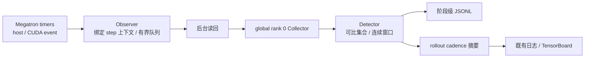
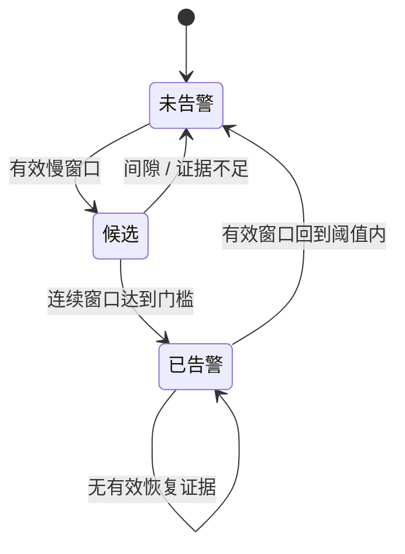

# 【No.11】训练慢卡诊断与平台上报设计（RFC）

提案人：@shanyulu · 导师：@Lemon-412 · 实现：[Draft PR #378](https://github.com/redai-studio/Relax/pull/378)

## 要回答的问题

训练变慢时，系统需要指出哪个 rank、哪个训练阶段持续偏离可比同伴，并把诊断送入现有训练日志和平台。结论必须区分观测事实、判定结果与根因推测：host/CUDA stream 区间可以定位延迟，不能单独证明是硬件、网络或算子故障。

[官方 Task 11](https://github.com/redai-studio/community/blob/main/contributor-program/2026-cohort-2/official-task.md#task-11)要求整体开销低于 0.5%、真实训练不影响精度/loss/通算重叠，以及通过平台定位慢卡。本 RFC 的配对设计、置信区间和门槛是本提案的验收方法；导师尚未确定 C1 主指标，不能把 pilot 当成官方通过。

| 当前状态 | 结论                                                                                                           |
| -------- | -------------------------------------------------------------------------------------------------------------- |
| 公开 PR  | #378 当前头 `c2875a5`，Draft；当前 CI 8/8 通过，代码评审待进行                                                 |
| 产品版本 | `927c5de`；当前 PR 头仅有 Python 3.10 测试竞态修复，`relax/` 零变更                                            |
| C1       | 旧版 6 对 pilot 为 `INCONCLUSIVE`；均值 +0.417%，95% bootstrap CI 上界 +2.023%                                 |
| C2       | a48a23b 旧 loss/grad 保持 `UNSCORED`；927c5de 参数、overlap、loss/grad 为独立证据，不能合并成一个未限定的 PASS |
| C3       | 阶段级 JSONL 与 rollout 级平台确认均有证据；实时口径待维护者裁决，逐事件时延 `UNMEASURED`                      |
| 范围待决 | C1 主指标、rollout cadence 是否满足实时、Attention/MoE schema-only 是否接受                                    |

## 数据路径

Collector 在 global rank 0 训练进程内，不是独立服务。跨 rank 聚合需要配置共享 collector 地址；否则各 rank 只能本地汇总。CUDA event 反映流上可观察区间，可能包含等待；它不是纯 kernel 或纯通信计时。嵌套阶段不能简单相加成整步时间。

| 层             | 行为                                                                      | 不能据此声称                            |
| -------------- | ------------------------------------------------------------------------- | --------------------------------------- |
| Timer/Observer | 沿用 Megatron timer；区间完成时绑定 workload 与 step；后台读回 CUDA event | 不承诺采样无损或零开销                  |
| Collector      | 接收 envelope、去重、记录迟到和丢弃                                       | 不新增训练 collective，不是独立常驻服务 |
| Detector       | 按拓扑与 workload 选可比参照；状态由候选、告警、恢复组成                  | 不从时间相关性推断根因                  |
| Reporter       | rollout 节奏输出确认告警指标到现有日志/TensorBoard                        | 不提供逐事件 ID 或端到端延迟保证        |

## 判定规则与故障语义

对每个拓扑与阶段先建立可比集合，再比较某 rank 的窗口 host 耗时中位数与集合内最快有效参照。默认需超过相对阈值及绝对耗时门槛，并连续 3 个有效窗口才确认。窗口数据不足时保留既有告警；不确定窗口不能作为恢复证据。工作量缺失会标记降级，可能仍产生判定；“无足够可比成员”和“缺 workload”是不同状态。

区间完成时写入对应 step/workload 上下文；读回线程不得在下一 step 取当前上下文。设备事件未就绪时后台重试，超出上限则标为设备耗时不可用，不填 0。队列耗尽、迟到、重复和丢弃分别记录。窗口由后续 envelope 推进，或由显式 flush 关闭；默认 5 秒窗口不是平台可见 SLA。

## 验收结果与解释

| 验收项                  | 产品与证据                                         | 当前结果                                                                                                                                                                                       |
| ----------------------- | -------------------------------------------------- | ---------------------------------------------------------------------------------------------------------------------------------------------------------------------------------------------- |
| C1：常驻开销            | `e961661`，6 对 pilot                              | 均值 +0.417%；95% CI \[-1.295%, +2.023%\]，`INCONCLUSIVE`。不能由点估计证明低于 0.5%；固定 N 确认实验等主指标裁决                                                                              |
| C2：训练指标            | `a48a23b` 原训练比较                               | 更新、step/token/LR 序列有记录；loss/grad 未在首个 ON 前冻结 band，旧结果保持 `UNSCORED`                                                                                                       |
| C2：参数                | `927c5de`，最终保留 checkpoint                     | 两对参数比较按各自冻结数值包络判 `PASS`；13 个有内容浮点组，169 个空占位项结构匹配。每对非张量叶 47/48 一致，唯一差异在 args 中含运行态路径/名称/TransferQueue ID 与端口；不称完整恢复状态等价 |
| C2：overlap             | `a48a23b` 与 `927c5de` 为不同实验                  | a48a23b 旧判定 `NOT_PASS` 保留；927c5de 新预注册独立实验在自己的包络内 `PASS`。后者不覆盖前者，也不证明严格零影响                                                                              |
| C2：新增 loss/grad 补验 | `927c5de`，4 个 OFF 校准臂 + 两对 OFF/ON，各 48 步 | `PASS_WITHIN_OFF_OFF_ENVELOPE`。loss 最大差 0.050019/0.048279，限值 0.233478；grad norm 最大差 8.38410/12.53071，限值 57.43427。旧 a48a23b 的 UNSCORED 不被回溯改写                            |
| C3：慢 rank 定位        | `927c5de`，公开输入包固定于 `7098b43`              | 健康臂 37 条 uncertain、0 条确认告警；减速目标 rank 3 四个阶段标签共 4 条确认告警，最大偏差 6.869×；另有 3 条非目标告警，按预注册窗口代理规则列为 false positive，因果来源未证实               |
| C3：平台与复算          | 同一公开输入包；独立重算在本地执行                 | TensorBoard rollout 级 rank 序列 3、3、2、2；不与阶段 JSONL 逐事件关联。公开包 29 项哈希及冻结分类复算一致；复算执行目录在本机。逐事件时延 `UNMEASURED`                                        |

C3 的公开输入包含脱敏后的 public job logs；其 SHA 与公开转换台账一致，且原件 SHA 另有记录。独立重算读取公开包后在本机完成。因此“公开输入可复算”指数据输入已公开且本地复算一致，不表示复算发生在 GitHub 或平台上。冻结结果称检测覆盖“三个阶段”与 JSON 实际四个阶段标签不一致；以原始包和复算报告为准，修订为四个标签。

另有 observer-on、未注入减速臂的自然告警记录，须与故障注入 C3 分开解释。对两条 ON 运行的原始 observer 记录复核后，可重算出 7 条 runtime-confirmed 告警；告警原因未定。分析器对非终态尾窗复放出另外 5 条候选，但对应 runtime status 为 `closed=false` 且仍有 2 个 open windows，M1/M2 collector status 又早于各自 manifest 完成时间；因此这 5 条不是可确认为已发布告警的终态证据，也不能据此证明最终无丢弃。该项审计报告与不可变证据链接待主线补入；在此之前不把 7 条告警归为误报，也不并入冻结 C3 误报统计。

本次 927c5de 新增 native loss/grad 补验的工具、协议、校准结果、测量锁和判定目前固定在本地 `233e5f8` 及其父提交；公开仓库尚无这些对象的可访问链接，故当前公开 PR 不能声称它们已可由维护者复算。只读工具门禁审计首版固定于本地 `ce39ee1`，含八臂 lineage/原件复核和 32 项定向测试；随后复审又发现重复 JSON 键、raw-root symlink 逃逸及输出拒绝覆盖等边界需补测修复，故 `ce39ee1` 不是最终门禁版本，最终工具提交待定。可复核的本地源为 `evidence/gpu_campaign/task11_3090/native_loss_927c5de/TOOL_GATE_AUDIT_20261001.md`、`evidence/gpu_campaign/task11_3090/native_loss_927c5de/measurement_verdict.json`、`evidence/NATIVE_LOSS_PROTOCOL_927C5DE_20260930.md`。参数差值图源为 `evidence/gpu_campaign/task11_3090/c2_parameter/parameter_deltas.svg`。发布时须由主线将本地源替换为真实不可变地址。参数原始 checkpoint 也没有公开下载渠道。哈希台账证明文件身份，不替代原件和独立存储。

## 已知边界

- 功能默认关闭；当前真机证据为单机 dense DP4，不外推到多机、MoE 或 PP>1。
- `confirmed_straggler_rank` 与 `confirmed_straggler_deviation` 是 rollout 级汇总；JSONL 是阶段级判定，没有共享事件 ID，无法计算逐事件可见时延。
- attention/MoE 目前只有 schema 预留，未通过真实插桩验收。
- 公开 C3 包能支持本地独立复算；大 checkpoint、3090 新 trace 与本地 native 补验仍需发布适当的证据包并完成下载后恢复复算。

## 请导师裁决

1. **C1 主指标**：官方 `<0.5%` 以 `perf/train_time` 还是 whole-job wall-clock 为准？另一项作为辅助。选定后再冻结样本量、配对次序、分析器与停止规则。
2. **C3 实时语义**：现有 rollout cadence 的平台导出是否满足“实时”？若不满足，先审最小异步导出方案；逐事件延迟当前未测。
3. **Attention/MoE**：本期接受 schema-only，还是要求真实粗粒度插桩？请同时给出验收阶段与判据。

当前结论是分项结果：C1 未定论、C2 含旧 NOT_PASS/UNSCORED 与新版本独立 PASS、C3 有定位证据但实时性待裁决。PR #378 保持 Draft；整体 Task 11 尚未达到 Ready for review。
