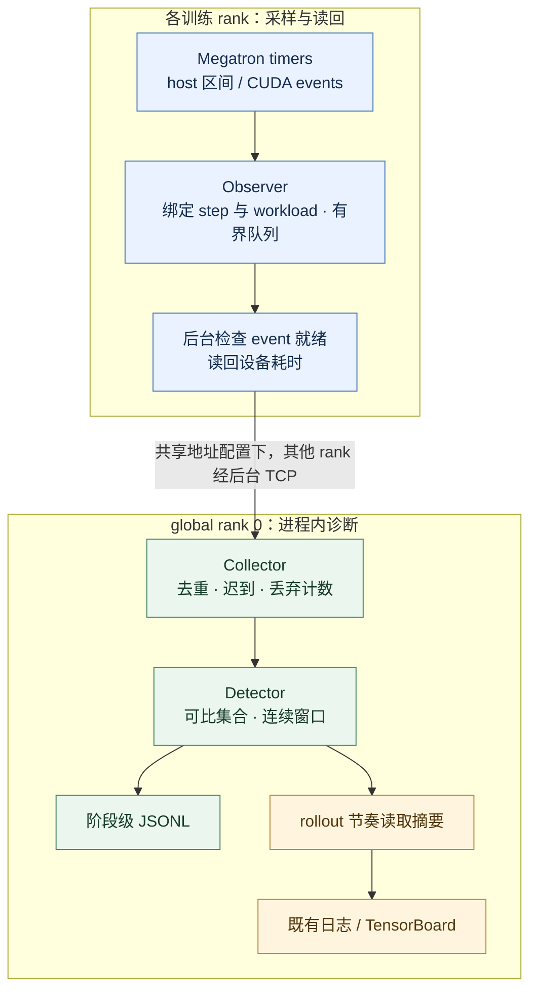
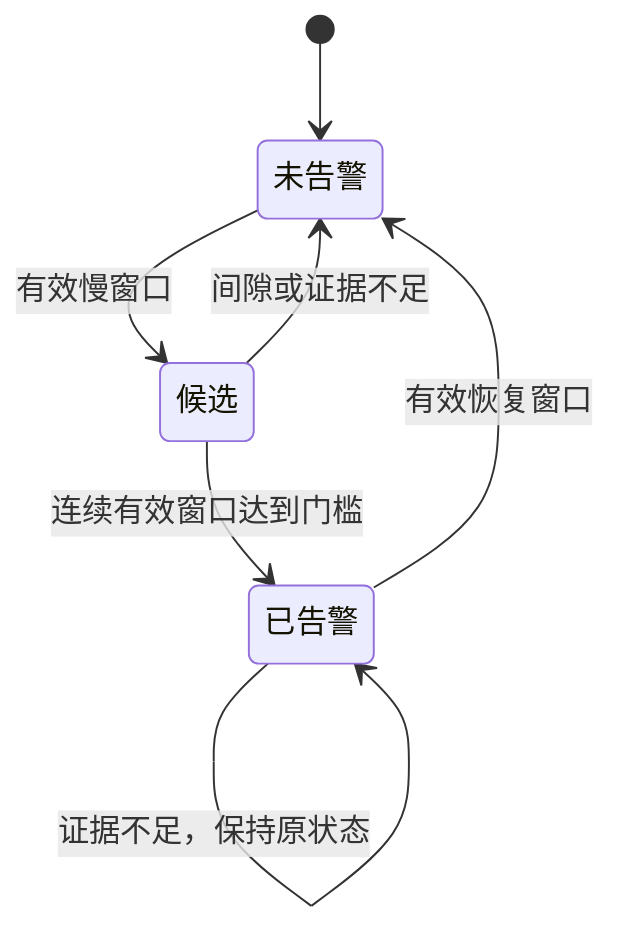

提案人：@shanyulu · 导师：@Lemon-412 · 实现：[Draft PR #378](https://github.com/redai-studio/Relax/pull/378)

## 1. 要解决的问题

训练变慢时，需要定位持续偏离可比同伴的 rank 和阶段，并把诊断送入已有训练平台。本设计沿用 Megatron timer，记录 host 与 CUDA stream 区间，以拓扑、阶段和工作量建立参照集合，再按连续窗口确认告警。

[官方 Task 11](https://github.com/redai-studio/community/blob/main/contributor-program/2026-cohort-2/official-task.md)的开销、训练数值、通算重叠和平台定位要求分别验收。功能默认关闭；当前真机范围为单机 dense DP4。host/stream 计时用于定位延迟，硬件、网络或算子根因需要额外证据。

## 2. 架构与取舍

CUDA 路径在区间结束时固定 step/workload 上下文，后台线程等 event 就绪后读回，避免把 step N 的计时配上 step N+1 的工作量。Collector 位于 global rank 0 训练进程内；跨 rank 汇总需要共享 collector 地址，未配置时各 rank 本地汇总。host-only 降级路径可能在调用线程交付。

CUDA event 表示流上可观察区间，可能包含等待；嵌套阶段不能直接相加为整步时间。有界队列、事件池和重试上限约束资源占用，迟到、重复、丢弃及设备读回不可用分别计数，缺失设备耗时不填零。诊断路径不新增训练 collective；采样开销由 C1 独立测量。

## 3. 告警规则与平台语义

每个拓扑和阶段先按 workload 建立可比集合，再比较该 rank 的窗口 host 耗时中位数与集合内最快有效参照。默认同时满足相对偏差、绝对耗时及连续三个有效窗口才确认。无有效恢复证据时保留已有告警；候选连续计数遇到间隙或不足证据会重置。workload 缺失会标记降级，可能仍产生判定。

JSONL 保留阶段级判定；TensorBoard 按 rollout 节奏导出确认 rank 与偏差摘要。两者没有共享逐事件 ID，端到端逐事件时延为 **UNMEASURED**。窗口由后续记录推进或显式 flush 关闭，默认五秒窗口不构成平台可见时延上界。

## 4. 当前结果

PR 头为 `c2875a5`，当前头 CI 8/8 通过；产品为 `927c5de`，后续只修复 Python 3.10 测试竞态。PR 保持 Draft。

| 验收项                   | 数据与判定                                                                                                                                              | 审查入口                                                                                                                                                                                                                                                                                                                              |
| ------------------------ | ------------------------------------------------------------------------------------------------------------------------------------------------------- | ------------------------------------------------------------------------------------------------------------------------------------------------------------------------------------------------------------------------------------------------------------------------------------------------------------------------------------- |
| C1：开销 \<0.5%          | `e961661` 的六对 `perf/train_time` pilot：均值 +0.417%，95% CI \[-1.295%, +2.023%\]，**INCONCLUSIVE**。当前产品确认实验未启动                           | [pilot verdict](https://github.com/shanyulu/Relax/blob/1c23f03d3553e26194c09f90d2ce0e85f7895c00/evidence/gpu_campaign/abba-e961661-run1/verdict.json)                                                                                                                                                                                 |
| C2：最终 checkpoint 参数 | `927c5de`，两对 OFF/ON；完整 lineage 与数值复算每对 182/182 entries 通过，零越界、零缺失容差。原件仍在本地                                              | [参数复算](https://github.com/shanyulu/Relax/blob/1c23f03d3553e26194c09f90d2ce0e85f7895c00/evidence/gpu_campaign/task11_3090/c2_parameter_replay_20261001/PARAMETER_REPLAY_20261001.md)                                                                                                                                               |
| C2：native loss/grad     | `927c5de`，四个 OFF 校准臂、两对测量，各 48 步；**PASS_WITHIN_OFF_OFF_ENVELOPE**，公开包下载后复算成功                                                  | [八臂审计](https://github.com/shanyulu/Relax/blob/1c23f03d3553e26194c09f90d2ce0e85f7895c00/evidence/gpu_campaign/task11_3090/native_loss_927c5de/TOOL_GATE_AUDIT_SOURCE_REMAP_20261001.md) · [原始包](https://github.com/shanyulu/Relax/releases/download/task11-evidence-20261001-1c23f03/NATIVE_LOSS_REPLAY_BUNDLE_20261001.tar.gz) |
| C2：3090 overlap         | 独立八臂 trace；允许下降 0.00145552，两对 ON−OFF 为 +0.00056297 / −0.00022059，**PASS（冻结门槛）**                                                     | [判定](https://github.com/shanyulu/Relax/blob/1c23f03d3553e26194c09f90d2ce0e85f7895c00/evidence/gpu_campaign/task11_3090/trace_overlap/O_MEASUREMENT_RESULT.json) · [八包原件](https://github.com/shanyulu/Relax/releases/tag/task11-evidence-20261001-1c23f03)                                                                       |
| C3：阶段定位             | 健康臂 37 条 uncertain、零确认告警；减速目标 rank 3 在四个阶段标签共四条确认告警，最大偏差 6.869×。三条非目标告警按冻结窗口代理规则归为误报，成因未证实 | [公开输入复算](https://github.com/shanyulu/Relax/blob/1c23f03d3553e26194c09f90d2ce0e85f7895c00/evidence/C3_RECOMPUTATION_REVIEW_20260930.md)                                                                                                                                                                                          |
| C3：平台确认             | TensorBoard 的 rollout 级确认 rank 序列为 3、3、2、2；“实时”是否满足要求待导师裁决                                                                      | [平台与原始结果](https://github.com/shanyulu/Relax/tree/1c23f03d3553e26194c09f90d2ce0e85f7895c00/evidence/gpu_campaign/c2p-927c5de/c3-v2)                                                                                                                                                                                             |

**参数覆盖。** 182 entries 包含十个 BF16 模型 storage 组、三个 FP32 optimizer 组及 169 个零元素 TE 占位，实验单位为两对 OFF/ON。非张量审查每对 47/48 叶一致，唯一差异叶为包含运行态字段的 `args`；据此不能声明完整可恢复状态等价。详见[覆盖审查](https://github.com/shanyulu/Relax/blob/1c23f03d3553e26194c09f90d2ce0e85f7895c00/evidence/PARAMETER_COVERAGE_REVIEW_20260930.md)及[非张量结果](https://github.com/shanyulu/Relax/blob/1c23f03d3553e26194c09f90d2ce0e85f7895c00/evidence/gpu_campaign/task11_3090/c2_parameter/P_NON_TENSOR_STATE_AUDIT_20260930_FINAL.md)。

**loss/grad 门槛。** 四个 OFF 臂产生六个共享对照，冻结容差为所有逐步绝对差最大值的两倍。两对 loss 最大差 0.05001947 / 0.04827869，限值 0.23347807；grad norm 最大差 8.384097 / 12.530714，限值 57.434275。逐步 step、token-volume、LR/update 序列门禁通过；token 体积一致不证明样本内容或顺序相同。该包络检查不等同于精度评估或统计等价性检验。

图示条形长度为最大差除以对应容差，未表示置信区间。四个 OFF 臂的六个对照共享数据，不能视为六个独立统计样本。

历史结果各自保留：`927c5de` 参数实验 P-M1/P-M2 的旧 loss 差 0.046285 / 0.030037、grad 差 7.94949 / 5.50596 因未提前冻结容差而保持 **UNSCORED**；新 L-M 补验不回写它们。`a48a23b` 的 overlap **NOT_PASS** 也不由新机器结果覆盖。整体 C2 仍需维护者接受各分项覆盖与公开原件边界。

## 5. 自然告警与尾窗限制

两条 observer-only ON 运行未配置所核查的延迟注入项。4,011 条 envelope 复放后，已保存 verdict payload 分别 **145/145、139/139** 匹配：七条确认告警、六条保存恢复、一条在快照中仍 active。四 rank 均有数据，告警窗口每 rank 有 4–5 个样本，token 量差 −1.25% 至 +0.33%，sequence/microbatch 数一致。

M2/w11 的三个 forward-compute 告警以 r0 为最快有效参照，现有数据无法区分 r1–r3 同时变慢与 r0 特别快。`gpu_stream_stall`/`host_only_stall` 是计时分类；这些未注入运行中的告警原因仍未知。[逐条窗口、参照、工作量与恢复记录](https://github.com/shanyulu/Relax/blob/1c23f03d3553e26194c09f90d2ce0e85f7895c00/evidence/gpu_campaign/task11_3090/native_loss_927c5de/NATURAL_ALERT_REVIEW_20261001.md)保留完整解释。

离线 flush 另产生五个尾窗候选，它们不是 live collector 保存的告警。两臂状态快照均为 `closed=false`，各有两个 open windows；pending readouts 为 6/1，快照早于作业结束。缺少终态 accounting，不能声称最终零丢弃，也不能将七条保存告警当作最终总数。

## 6. 公开复算与待决范围

[证据分支](https://github.com/shanyulu/Relax/tree/1c23f03d3553e26194c09f90d2ce0e85f7895c00/evidence)固定工具、协议、结果和哈希。[Release](https://github.com/shanyulu/Relax/releases/tag/task11-evidence-20261001-1c23f03)提供八臂 native-loss 小包及八个 3090 trace 原件包；已重新下载校验并复算，见[公开下载复算记录](https://github.com/shanyulu/Relax/blob/41f2521cfef7dd3dc2bbd8e10dbb3f8a8dccf5de/evidence/public_download_replay_20261001/PUBLIC_DOWNLOAD_REPLAY.md)。[小包说明](https://github.com/shanyulu/Relax/blob/1c23f03d3553e26194c09f90d2ce0e85f7895c00/evidence/gpu_campaign/task11_3090/native_loss_927c5de/BUNDLE_README_20261001.md)记录冻结时的本地状态，实际下载入口以上述 Release 为准。

小包不包含训练环境、模型或约 258 GiB 参数原件。参数原件的独立存储和完整第三方复算仍待闭合；同盘归档不能作为独立备份。PP>1、多机和 MoE 未列入已验收范围。

请导师确认三项：

1. **C1 主指标**：使用 `perf/train_time` 还是 whole-job wall-clock 判定 \<0.5%；确定后再冻结最终产品、固定 N、配对顺序、分析器和停止规则。
2. **平台实时性**：本期是否接受现有 rollout cadence；若不接受，先审最小异步导出设计，再改产品并重验受影响项目。
3. **Attention/MoE**：接受 schema-only，还是要求实际粗粒度插桩；若要求，请明确阶段和判据。

当前已取得分项证据，C1、实时性与范围裁决仍开放。PR 转 Ready 需当前头 CI 通过、C1 正式结论、C2 覆盖获接受、C3/范围裁决落实及无未解决评审线程。
