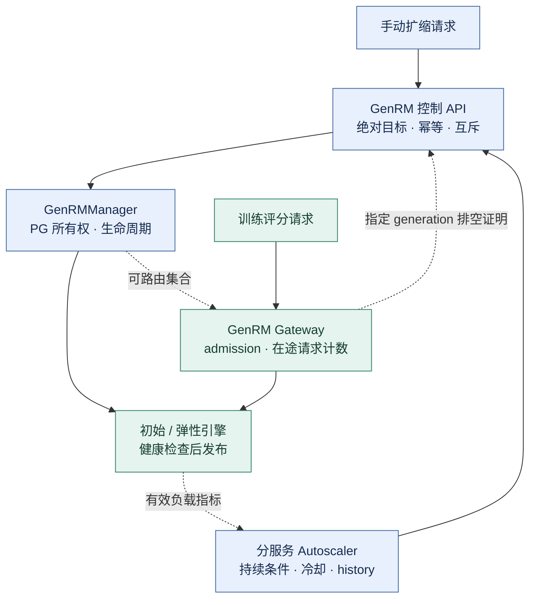

## 改动目的

为冻结奖励模型 GenRM 增加弹性副本生命周期，并接入现有 Autoscaler。负载升高时，新引擎通过健康检查后接流量；负载回落时，排空弹性副本并回收资源，保留初始引擎。

设计与取舍见 [RFC #351](https://github.com/redai-studio/Relax/issues/351)，字段与错误码见 [中文 API](https://github.com/redai-studio/Relax/blob/da4acbbab530f082f37c1633c811c704be5a044e/docs/zh/api/genrm.md) / [OpenAPI](https://github.com/redai-studio/Relax/blob/da4acbbab530f082f37c1633c811c704be5a044e/docs/public/openapi/genrm.json)。本期范围为**单 Gateway 排空、单 GPU 弹性副本**。

| 当前状态      | 结果                                                                                                                                                                                                                                 |
| ------------- | ------------------------------------------------------------------------------------------------------------------------------------------------------------------------------------------------------------------------------------ |
| PR / 产品版本 | PR 头 [da4acbb](https://github.com/redai-studio/Relax/commit/da4acbbab530f082f37c1633c811c704be5a044e)；产品 [0481701](https://github.com/shanyulu/Relax/commit/048170127f3ef4a7ea6255b5e5e01240b03876bc)，`relax/` 产品代码保持不变 |
| CI            | `da4acbb` 当前头 8/8 通过：pre-commit、Python 3.10/3.11/3.12、H20 4-GPU 单测、三项训练集成（含一项 NPU）                                                                                                                             |
| 专用验收      | 生命周期、评分对照、自动扩缩、故障收尾及训练运行证据见下表；各自保留运行版本                                                                                                                                                         |
| 尚待确认      | 当前头 approval；Task 3 对接、artifact 归属、验收规模、内容确定性采样四项裁决                                                                                                                                                        |

产品头之后仅变更 API / 证据文档、OpenAPI 生成脚本及两处测试 lint 注释，运行时代码未变。

## 实现结构

实线为调用，虚线为状态、发现或观测关系。GenRM 扩缩不引入训练权重同步；actor→rollout 原有同步仍然保留。

### 建议审查顺序

| 审查入口                                                                                                                                                                                                                                                                                 | 关键改动                                                                                                 | 重点检查                                                                       |
| ---------------------------------------------------------------------------------------------------------------------------------------------------------------------------------------------------------------------------------------------------------------------------------------- | -------------------------------------------------------------------------------------------------------- | ------------------------------------------------------------------------------ |
| [Manager](https://github.com/redai-studio/Relax/blob/da4acbbab530f082f37c1633c811c704be5a044e/relax/distributed/ray/genrm.py)                                                                                                                                                            | 创建 PG 时即登记 owner；候选就绪后发布；固定 victim 排空；弹性槽位永久退役                               | 迟到初始化不发布；PG 未确认回收时不放行；`recover()` 不重建已缩掉的副本        |
| [组件](https://github.com/redai-studio/Relax/blob/da4acbbab530f082f37c1633c811c704be5a044e/relax/components/genrm.py) / [Registry](https://github.com/redai-studio/Relax/blob/da4acbbab530f082f37c1633c811c704be5a044e/relax/utils/genrm_scale_registry.py)                              | 绝对目标、幂等指纹、同模型互斥、generation 排空、状态查询与 reconcile                                    | 超时只是 abort；逻辑终态与 `cleanup_required` 分离；无法取得权威容量时拒绝提交 |
| [Autoscaler](https://github.com/redai-studio/Relax/blob/da4acbbab530f082f37c1633c811c704be5a044e/relax/utils/autoscaler/autoscaler_service.py) / [指标](https://github.com/redai-studio/Relax/blob/da4acbbab530f082f37c1633c811c704be5a044e/relax/utils/autoscaler/metrics_collector.py) | Rollout 与 GenRM 各自维护 discovery、collector、decision engine、pending 和历史；应用 `service_policies` | 缺失/过期不当作空闲；不同条件使用自己的有效分母；冷却状态不串服务              |
| [评分参数](https://github.com/redai-studio/Relax/blob/da4acbbab530f082f37c1633c811c704be5a044e/relax/components/genrm.py#L390)                                                                                                                                                           | 默认采样 seed 由模型、token 输入和有效参数派生；显式 seed 优先                                           | 改变重复请求随机性，是待确认的产品契约，不只是内部修复                         |
| [TUI](https://github.com/redai-studio/Relax/blob/da4acbbab530f082f37c1633c811c704be5a044e/relax/utils/autoscaler/monitor.py) / [API 文档](https://github.com/redai-studio/Relax/blob/da4acbbab530f082f37c1633c811c704be5a044e/docs/zh/api/genrm.md)                                      | `--service genrm`；按服务展示状态、条件、历史；动态容量                                                  | 保留 Rollout 默认视图；降级快照不能冒充资源释放证明                            |

### 失败路径的行为

- 扩容终态为 `ACTIVE / PARTIAL / FAILED`；`PARTIAL` 保留已发布副本，不代表达到目标。
- 缩容先关闭 admission，再等指定 generation 的在途请求清零，最后退役 worker 并确认 owned PG 为 `REMOVED`。
- 超时后保持原操作互斥；原物理线程未结束时 reconcile 返回可重试冲突。清理成功只清除 `cleanup_required`，不把原 `FAILED` 改成成功。
- 容量分别报告 `current / ready / occupied / pending_cleanup`：未发布候选不增加服务容量；失败缩容 victim 未释放前仍计入已发布容量与资源占用。

正常链路、超时收尾时序和容量示例见 [RFC 架构说明](https://github.com/redai-studio/Relax/issues/351)。

## 验证

原始证据固定于 `fdf288d`，各实验的运行版本见下表。评分复确认与任务相关 CPU 回归在最终产品 `0481701` 上完成。

| 验收项       | 运行版本  | 结果                                                                              | 原始证据                                                                                                                                                         |
| ------------ | --------- | --------------------------------------------------------------------------------- | ---------------------------------------------------------------------------------------------------------------------------------------------------------------- |
| 手动扩缩     | `a2ca6cb` | 1→2→1；4,163 请求零失败；初始引擎保留、资源回归                                   | [生命周期运行](https://github.com/shanyulu/Relax/tree/fdf288d705ddbefa7f8de9fbad050f7ed3ac4f27/demos/task4_genrm/results/e2e_run_20260924)                       |
| 评分一致性   | `0481701` | 50 输入、800 条引擎归属回复；完整解析、零截断；greedy 一致，采样 0/50 翻转        | [最终代码复确认](https://github.com/shanyulu/Relax/tree/fdf288d705ddbefa7f8de9fbad050f7ed3ac4f27/demos/task4_genrm/results/reward_consistency_20260927_final_r6) |
| 不同请求历史 | `0481701` | 初始引擎先额外处理 300 次采样；再比较 50 输入、400 条归属回复，0/50 翻转          | [历史扰动对照](https://github.com/shanyulu/Relax/tree/fdf288d705ddbefa7f8de9fbad050f7ed3ac4f27/demos/task4_genrm/results/sampling_divergence_20260927_final_r4)  |
| 控制契约     | `0481701` | 278 项任务相关 CPU 回归通过；幂等、409、非法目标与初始保护                        | [CPU 回归记录](https://github.com/redai-studio/Relax/blob/da4acbbab530f082f37c1633c811c704be5a044e/demos/task4_genrm/EVIDENCE.md#L9)                             |
| 自动扩缩     | `5c1e2e7` | 冻结断言 14/14；1,568 请求零失败；弹性引擎处理 181 请求；真空闲缩容与资源回收通过 | [最终协议轮次](https://github.com/shanyulu/Relax/tree/fdf288d705ddbefa7f8de9fbad050f7ed3ac4f27/demos/task4_genrm/results/autoscaler_prereg_v2_20260926_final_r3) |
| 故障收尾     | `e7224af` | 长请求排空、deadline-abort 后保持互斥并 reconcile、kill-victim 三场景通过         | [故障注入](https://github.com/shanyulu/Relax/tree/fdf288d705ddbefa7f8de9fbad050f7ed3ac4f27/demos/task4_genrm/results/failure_injection_20260925_r2)              |
| 训练继续完成 | `945741e` | 8/8 步执行完成，8/8 rollout 完成；日志记录 64 个保存样本；扩容窗有 rollout 进展   | [日志与再分析](https://github.com/shanyulu/Relax/tree/fdf288d705ddbefa7f8de9fbad050f7ed3ac4f27/demos/task4_genrm/results/train_continuity_20260925_r5)           |

训练结论采用[再分析 v2.1](https://github.com/shanyulu/Relax/blob/fdf288d705ddbefa7f8de9fbad050f7ed3ac4f27/demos/task4_genrm/results/train_continuity_20260925_r5/REANALYSIS_V2.md)。仓库旧索引的“全程零错误”和“全程停顿不超过 120 秒”表述已撤回：日志有三条非良性带时间戳错误记录，judge 错误行数与双副本稳定窗口内的错误行数均为 0；事件间隔不能作为全程停顿上界。

其余限制：

- **训练完成不等于零性能影响。** 最大进度间隔跨过扩缩边界；没有同配置、不扩缩的对照。缩容窗约 1 秒，无窗内训练事件，不声称该窗内持续更新。
- 64 个样本来自保存日志；rollout ID 无缺漏/重复，但逐样本 JSONL 未保留，未做内容级完整性与去重核验。该训练轮的弹性副本贡献仅有一个计数器归属请求；跨副本评分由独立归属实验验证。
- 0/50 只说明固定输入与配置下未观察到翻转，不证明模型判题能力或普遍确定性。PG 资源计数排除 `REMOVED` 墓碑，不能用原始表长度判泄漏。

真实验收截图：GenRM 的状态、扩缩条件与操作历史

截图来自自动扩缩最终轮，固定于上述 evidence commit；用于检查观测界面，不替代整轮事件与 verdict。Rollout 对照截图与原始记录保留在同一目录。

## 兼容性与未覆盖范围

旧 Rollout 顶层字段和默认 TUI 行为保留。两服务的冷却计时状态独立，但冷却时长配置仍由 deployment 提供。GenRM 自动扩缩目标目前只支持单模型实例，发现多个活跃实例时拒绝混合处理。

单 Gateway 计数不覆盖 direct client / 跨 Gateway 的完整排空；组件重启后的持久幂等、Manager 重启后的在途恢复、多 GPU 弹性副本，以及弹性操作与运行时 onload/offload 的协调，均不在本期范围。

## 请维护者确认

1. **Task 3 对接**：当前四条统一 inference PR（[#347](https://github.com/redai-studio/Relax/pull/347)、[#356](https://github.com/redai-studio/Relax/pull/356)、[#368](https://github.com/redai-studio/Relax/pull/368)、[#381](https://github.com/redai-studio/Relax/pull/381)）均未合入且与本 PR 的 GenRM 文件重叠。请指定采用哪条路线，以及 #370 独立合入还是先集成重验。
2. **仓库范围**：driver、manifest、原始 artifacts 的保留与迁出边界。
3. **验收规模**：4×RTX 4090、Qwen3-0.6B 是否满足本期生命周期与路由验收。
4. **评分语义**：是否接受未显式指定 seed 时的内容确定性采样；若需要重复调用的随机多样性，应另行定义请求身份契约。

当前头仍需正式 review。[不可变证据目录](https://github.com/shanyulu/Relax/tree/fdf288d705ddbefa7f8de9fbad050f7ed3ac4f27/demos/task4_genrm/results/)保留全部已归档轮次及各自判定；[早期进度评论](https://github.com/shanyulu/Relax/blob/33fc1d72ab1a386c51a427f4e890661504584da3/review/task11-publication-20260930/PR_COMMENT_ARCHIVE_20261001.json)另存作历史记录。
