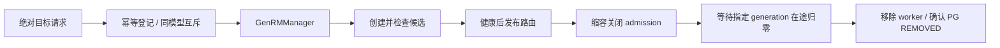

## 改动目的

为冻结奖励模型 GenRM 增加弹性副本生命周期，并接入现有 Autoscaler。扩容时，候选引擎完成健康检查后才接流量；缩容时，关闭单 Gateway admission、排空指定 generation，再退役 worker 并回收 owned PG。设计背景和契约边界见 [RFC #351](https://github.com/redai-studio/Relax/issues/351)。

## 当前状态

| 项目             | 结果                                                          |
| ---------------- | ------------------------------------------------------------- |
| PR 头 / 产品版本 | `da4acbb` / `0481701`；PR 头后产品运行时代码未变              |
| CI               | 当前头 8 项必需检查成功；PR open、非 Draft，等待维护者 review |
| 验收范围         | 单 Gateway 排空、单 GPU 弹性副本、单模型 Autoscaler target    |
| 待裁决           | Artifact 归属、4×RTX 4090 验收规模、内容派生 seed 的采样语义  |

## 生命周期

失败时，操作终态和清理状态分开表达。deadline 只触发 abort；物理任务仍运行或 PG 未确认移除时，同模型互斥保留。reconcile 只处理原 victim，不另选副本；`FAILED` 清理成功后不会被改写成成功。容量字段分别表示可服务副本和仍占用资源的副本。

Autoscaler 在一个 deployment 中为 Rollout 与 GenRM 隔离 discovery、collector、decision、cooldown、pending 操作和 history。缺失或过期指标不按零负载处理；TUI、conditions、metrics history 与 scale history 按服务提供视图。字段与错误码见 [GenRM API](https://github.com/redai-studio/Relax/blob/da4acbbab530f082f37c1633c811c704be5a044e/docs/zh/api/genrm.md)和 [OpenAPI](https://github.com/redai-studio/Relax/blob/da4acbbab530f082f37c1633c811c704be5a044e/docs/public/openapi/genrm.json)。

## 代码审查入口

| 入口                                                                                                                                           | 检查重点                                                                             |
| ---------------------------------------------------------------------------------------------------------------------------------------------- | ------------------------------------------------------------------------------------ |
| [GenRMManager](https://github.com/redai-studio/Relax/blob/da4acbbab530f082f37c1633c811c704be5a044e/relax/distributed/ray/genrm.py)             | PG owner 记账、迟到初始化不发布、固定 victim、失败清理与 reconcile、弹性槽位永久退役 |
| [GenRM API / Registry](https://github.com/redai-studio/Relax/blob/da4acbbab530f082f37c1633c811c704be5a044e/relax/components/genrm.py)          | 绝对目标、幂等指纹、互斥、generation 排空证明、状态与容量                            |
| [Autoscaler](https://github.com/redai-studio/Relax/blob/da4acbbab530f082f37c1633c811c704be5a044e/relax/utils/autoscaler/autoscaler_service.py) | 服务状态隔离、有效指标覆盖、策略应用和向后兼容                                       |
| [验收驱动与原始运行](https://github.com/shanyulu/Relax/tree/fdf288d705ddbefa7f8de9fbad050f7ed3ac4f27/demos/task4_genrm/results/)               | 固定协议、事件、verdict、截图和运行版本                                              |

## 验收记录

每项证据按其真实运行版本归属；不将后续产品头回写为历史运行版本。

| 验收         | 版本      | 结果                                                                                                                              |
| ------------ | --------- | --------------------------------------------------------------------------------------------------------------------------------- |
| 手动 1→2→1   | `a2ca6cb` | 4,163 请求零失败，初始引擎存活，资源回归                                                                                          |
| 评分复确认   | `0481701` | 50 输入、800 条引擎归属回复；完整判定可解析，greedy 一致、采样 0/50 翻转                                                          |
| 请求历史扰动 | `0481701` | 初始引擎先额外采样 300 次；50 输入、400 条回复，0/50 翻转                                                                         |
| 控制契约回归 | `0481701` | 278 项任务相关 CPU 测试通过；包含幂等、409、非法目标、初始副本保护                                                                |
| 自动扩缩     | `5c1e2e7` | 冻结断言 14/14；1,568 请求零失败；弹性副本处理 181 请求；空闲缩容和资源回收通过                                                   |
| 故障收尾     | `e7224af` | 长请求排空、deadline abort 后互斥/reconcile、kill-victim 场景通过                                                                 |
| 训练运行     | `945741e` | 8/8 step 与 rollout 完成；日志记录 64 个保存样本。最大 step-start 间隔跨过扩容边界，不能据此量化扩缩性能影响；逐样本 JSONL 未留存 |

评分测试证明限定输入与配置下的新旧副本输出一致，不证明模型判题准确率或所有输入上的普遍确定性。训练连续性日志有错误记录，旧索引中“全程零错误”和“全程停顿不超过 120 秒”的表述已撤回。弹性副本在训练轮中的贡献仅有一个计数器归属请求；路由归属由单独评分运行验证。

截图用于核对服务状态、扩缩条件和操作历史；判断以同目录完整事件和 verdict 为准。

## 兼容性与限制

- Rollout 原有顶层字段和默认 TUI 保留；冷却计时独立，冷却时长配置仍由 deployment 提供。
- 自动 GenRM 扩缩仅面向单模型实例；发现多个活跃实例时拒绝混合决策。
- admission/drain 证据来自单 Gateway 适配器；direct client、跨 Gateway lease、Manager 重启恢复、多 GPU 弹性副本及 onload/offload 协调不在本 PR 承诺内。
- Ray 的 `REMOVED` 墓碑保留在 placement-group 表中；资源回收按非终态 PG、GPU 空闲量和显存核验，不能用表总行数判断泄漏。

## 待维护者确认

1. PR 内 driver/manifest 与原始 evidence 的归属边界。
2. 4×RTX 4090、Qwen3-0.6B、单 GPU 弹性副本是否满足本期验收规模。
3. 未显式给 seed 时按请求内容派生 seed，导致相同内容的独立请求复用随机流，是否为可接受契约。

若第三项不接受，需要先确定请求身份与随机性语义，再改代码并重跑评分及受影响验收；不能将目前的内容派生 seed 说成尚未实现。当前头需正式 review 后才能合入。
