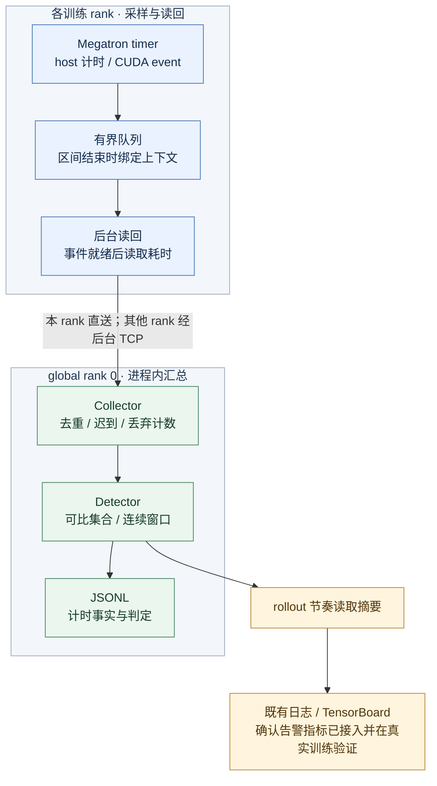

## 改动目的

为 Megatron 训练增加默认关闭的慢 rank 诊断：沿用已有 timer 记录 host/CUDA 区间，按可比 rank 的连续窗口定位阶段性偏差，并接入现有日志与 TensorBoard。设计、取舍和完整实验解释见 [RFC #357](https://github.com/redai-studio/Relax/issues/357)。

**保持 Draft。** 当前公开 PR 头为 [c2875a5](https://github.com/shanyulu/Relax/commit/c2875a5c219fcef38011ea93ce617b74a8efef08)，产品为 `927c5de`，CI 8/8 通过。新机器上的两对参数比较已通过冻结门槛，但本轮 loss／grad 无预先冻结容差，仍为 UNSCORED；不能据此宣告整体 C2 通过。C1 未确认，C3 实时口径及 attention/MoE 范围待裁决。

本文为本地发布候选，未更新 GitHub。新增结论与下列本地证据绑定；原始 checkpoint 尚无公开下载渠道，不能称为公开复算闭环。

## 实现与审查入口

图示为 CUDA 路径且配置共享 collector 地址时的行为。汇总位于 global rank 0 进程内，不是独立服务。未配置共享地址时，各 rank 本地汇总；纯 host-only 模式可能在调用线程交付，不能声称所有处理都在后台。

建议按以下顺序审查：

| 入口                                                                                                                                                                                                                                                                                  | 重点检查                                                    |
| ------------------------------------------------------------------------------------------------------------------------------------------------------------------------------------------------------------------------------------------------------------------------------------- | ----------------------------------------------------------- |
| [model.py](https://github.com/shanyulu/Relax/blob/c2875a5c219fcef38011ea93ce617b74a8efef08/relax/backends/megatron/model.py)、[actor.py](https://github.com/shanyulu/Relax/blob/c2875a5c219fcef38011ea93ce617b74a8efef08/relax/backends/megatron/actor.py)                            | timer 注入位置、开关关闭行为、workload 上下文               |
| [timer shim](https://github.com/shanyulu/Relax/blob/c2875a5c219fcef38011ea93ce617b74a8efef08/relax/utils/straggler/megatron_timer_shim.py)、[observer.py](https://github.com/shanyulu/Relax/blob/c2875a5c219fcef38011ea93ce617b74a8efef08/relax/utils/straggler/observer.py)          | 区间结束时固定上下文；后台 event 读回；host-only 降级不越序 |
| [runtime.py](https://github.com/shanyulu/Relax/blob/c2875a5c219fcef38011ea93ce617b74a8efef08/relax/utils/straggler/runtime.py)、[collector.py](https://github.com/shanyulu/Relax/blob/c2875a5c219fcef38011ea93ce617b74a8efef08/relax/utils/straggler/collector.py)                    | 有界队列、进程内汇总、重复 / 迟到 / 丢弃、退出与 flush      |
| [detector.py](https://github.com/shanyulu/Relax/blob/c2875a5c219fcef38011ea93ce617b74a8efef08/relax/utils/straggler/detector.py)                                                                                                                                                      | 可比集合内选参照；候选连续计数与已生效告警分离              |
| [reporter.py](https://github.com/shanyulu/Relax/blob/c2875a5c219fcef38011ea93ce617b74a8efef08/relax/utils/straggler/reporter.py)、[train_metric_utils.py](https://github.com/shanyulu/Relax/blob/c2875a5c219fcef38011ea93ce617b74a8efef08/relax/utils/training/train_metric_utils.py) | 既有平台路径、确认告警归属、读取摘要的副作用                |
| [单元与回归测试](https://github.com/shanyulu/Relax/tree/c2875a5c219fcef38011ea93ce617b74a8efef08/tests/utils/straggler)                                                                                                                                                               | 顺序、退化、窗口间隙、低负载状态机及故障边界                |

### 关键语义

- 相对偏差以该 rank 的窗口 host 耗时中位数，对比**工作量可比集合中的最快成员**；不使用全 cohort 最快值替代有效参照。
- `a48a23b` 已修复低负载窗口清除告警、onset 连续计数跨间隙串联等问题。不确定窗口不能被当成恢复证据。
- `927c5de` 进一步加入确认告警指标（`confirmed_straggler_deviation/rank`，排除 uncertain/recovered，保留原 `worst_rank` 语义）、静默摘要读取，并将 collector 的文件写入与外部回调移出状态锁（写阻塞/写失败/回调阻塞三条 old-fail/new-pass 回归钉住）。
- `c2875a5` 修复 Python 3.10 CI 的一个测试竞态（`test_pool_exhausted_interval_never_writes_on_the_training_thread` 在 readout 守护线程送达前发起显式 flush，导致 "no background thread ever wrote" 间歇失败）：改为先等待 readout 送达全部 envelope 再 flush，并以 try/finally 保证 observer 关闭。仅测试文件变更，产品代码零改动。
- 工作量缺失会标记降级，仍可能产生判定；没有足够可比成员与工作量缺失不是同一分支。
- CUDA event 表示流上可观察区间。host / stream stall 是诊断提示，不是硬件根因证明。
- 窗口由后续记录推进或显式 flush 关闭；默认 5 秒窗口不是平台可见时延上界。

## 当前验收

| 项目                     | 证据与版本                                                                                                                                                                                                                                                                      | 当前结论                                                                                                       |
| ------------------------ | ------------------------------------------------------------------------------------------------------------------------------------------------------------------------------------------------------------------------------------------------------------------------------- | -------------------------------------------------------------------------------------------------------------- |
| 当前头 CI                | **`c2875a5` 8/8 通过**（[通用 CI](https://github.com/redai-studio/Relax/actions/runs/36558249666)、[GPU 单测](https://github.com/redai-studio/Relax/actions/runs/36558249592)、[训练集成](https://github.com/redai-studio/Relax/actions/runs/36558249838)）                     | 回归通过，不代表 C1/C2/C3 官方验收通过                                                                         |
| C1：整体开销 \<0.5%      | e961661；6 对 AB/BA，均值 +0.417%，95% CI \[-1.295%, +2.023%\]                                                                                                                                                                                                                  | **INCONCLUSIVE**；旧版本 pilot，不是当前头确认验收                                                             |
| C2：历史训练指标         | a48a23b；两对 ON/OFF，loss / 梯度范数在冻结包络内，学习率一致、token 差为 0                                                                                                                                                                                                     | 历史参考，不作为当前产品验收                                                                                   |
| C2：最终 checkpoint 参数 | **927c5de／4×3090**；四个 OFF 校准臂、两对 OFF/ON 测量臂，均 48 步；结果提交 `116d527`                                                                                                                                                                                          | **本地 PASS**：13 个有内容浮点组与 169 个空占位项在冻结包络内；不是位确定性，也不覆盖完整 optimizer 非张量状态 |
| C2：本轮原生训练旁证     | **927c5de／4×3090**；两对更新数 48/48，step/token/LR 序列一致，数值 NaN/Inf 为 0                                                                                                                                                                                                | loss／grad **UNSCORED**：未在 ON 前冻结同版容差，不能继承 a48a23b 的 band                                      |
| C2：3090 独立 overlap    | **927c5de**；四个 OFF 校准臂、两对 ON/OFF；冻结允许下降 0.001455524，Δ 为 +0.000562970 / −0.000220593                                                                                                                                                                           | **本地 PASS**；独立协议，不覆盖旧 NOT PASS；32 件 trace 的大归档尚待公开存储                                   |
| C2：先前已公开 overlap   | **927c5de／先前独立机器及协议**：4 OFF 臂冻结包络 0.029499，两对 AB/BA 的 Δ 为 -0.000484 / -0.002609；[判定与原始 trace](https://github.com/shanyulu/Relax/tree/7098b43/evidence/gpu_campaign/c2p-927c5de)可复算。a48a23b 的 NOT PASS 按其版本保留                              | **PASS（该预注册门槛）**；不与本轮 3090 合并样本，不是严格零影响                                               |
| C3：定位与上报           | **927c5de**：[公开结果摘要](https://github.com/shanyulu/Relax/blob/7098b43/evidence/gpu_campaign/c2p-927c5de/c3-v2/C3_RESULT.md)：健康臂 0 告警，目标 rank 3 在四个阶段标签有 4 条确认告警；TensorBoard 汇总为 3、3、2、2；3 条非目标告警按冻结代理规则计为误报，因果来源未证实 | rollout 级平台确认已观测；逐事件时延 UNMEASURED，“实时”待裁决；原始两臂尚未公开复算                            |

Overlap 的 PASS 限于预注册门槛：OFF/OFF 噪声推得的允许下降 0.029499，约为测量臂 OFF 比值的 8%。实际两对 ON−OFF 仅为 -0.000484 / -0.002609；这不证明严格零影响，也不是 \<0.5% 性能开销的替代证据。

公开证据索引固定于 [7098b43](https://github.com/shanyulu/Relax/tree/7098b43/evidence)：[C1 pilot](https://github.com/shanyulu/Relax/blob/7098b43/evidence/gpu_campaign/abba-e961661-run1/verdict.json)、[a48a23b 旧版 C2 复核（INCOMPLETE）](https://github.com/shanyulu/Relax/blob/7098b43/evidence/gpu_campaign/c2-a48a23b/measurement/C2_COMPARE_REVIEWED.json)、[927c5de 先前已公开 overlap 的 32 件 trace](https://github.com/shanyulu/Relax/tree/7098b43/evidence/gpu_campaign/c2p-927c5de/trace_dp4)、[C3 结果摘要](https://github.com/shanyulu/Relax/blob/7098b43/evidence/gpu_campaign/c2p-927c5de/c3-v2/C3_RESULT.md)。C3 原始两臂及新版参数来源链尚未推送，公开复算不完整；不把本地提交链接写成已公开证据。各实验只按其运行产品 SHA 判定，不跨版本继承。

本轮独立审查、工具与台账：本地 `021bbd69b9f7654af68cee9ba10687e0710e59ca`。入口为 [参数覆盖审查](../../evidence/PARAMETER_COVERAGE_REVIEW_20260930.md)、[恢复工具与边界](../../evidence/PARAMETER_REPLAY_GUIDE_20260930.md)、[trace 归档重算](../../evidence/gpu_campaign/task11_3090/trace_overlap/ARCHIVE_RECOMPUTATION_20260930.md)、[C3 重算](../../evidence/C3_RECOMPUTATION_REVIEW_20260930.md)。授权发布前必须替换为真实可访问的不可变链接。

## 尚待关闭

### 参数结果的解释边界

两对测量覆盖 10 个 BF16 模型 storage（596,049,920 元素）与三个同规模 FP32 optimizer storage（master parameter、exp_avg、exp_avg_sq）；169 项是零元素占位，不增加覆盖量。DCP 元数据、adapter 与 inventory 的 key／shape／dtype／chunk 覆盖一致。48 个非张量叶未比较，不能称为完整恢复状态等价。

图只展示 13 个有内容浮点组；零容差下数值相等单独标记。比较单位是两对实验，不是 182 个独立样本。图、覆盖审查与原生训练审计均为本地候选资产；发布前须固定到可访问的不可变证据提交，不能把相对路径原样粘贴到 GitHub。

1. **C1 正式开销验收**：导师确定主指标后，在最终产品上冻结样本量、顺序、分析器与停止规则，再做固定 N 的确认实验。旧 pilot 的 +0.417% 点估计不能抵消 +2.023% 的 CI 上界。
2. **C2 剩余边界**：正式参数测量已完成，不再重复四个 OFF 或追加测量求通过。独立审查确认模型与三类 optimizer 浮点 storage 覆盖；48 个非张量叶（含 optimizer step／超参数、scheduler）未比较。本轮 loss／grad 未冻结容差，须由维护者接受替代证据，或另立新协议先校准再测量；不可事后补 band。大原件需独立持久存储与恢复验证，不能用哈希台账代替。
3. **C3 与范围裁决**：明确 rollout 节奏是否满足实时上报，以及 attention/MoE 仅 schema 是否可接受。当前证据为单机 dense DP4，PP>1 的汇总与导出归属仍未闭合。

## 转正式审查的条件

- 当前头 CI 保持全绿，无未解决的代码评审线程。
- 导师确定 C1 主指标后，冻结最终产品、样本量、顺序、分析器和停止规则，取得正式确认结论；不运行到通过为止。
- C2 参数、loss／grad 与 overlap 门禁均闭合；本轮 loss／grad 为 UNSCORED，须取得明确替代验收，或按独立新协议完成验证；原件能独立恢复。
- C3 阶段级 JSONL 定位与 rollout 级 TensorBoard 确认已完成；[实时 cadence、attention/MoE 范围及 C1 主指标](https://github.com/redai-studio/Relax/issues/357#6-支持范围与待决定事项)取得明确裁决。

产品代码由本 PR 承载，设计以 RFC 为准，实验失败及原始记录保留在 evidence。本文只列当前可支持的结论，不以 CI 绿灯代替官方验收。
