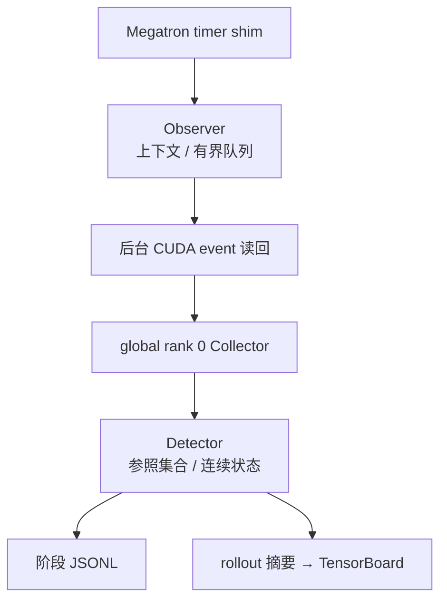

## 改动目的

为 Megatron RL 训练增加默认关闭的慢 rank 诊断。实现沿用 timer 挂点，记录 host/CUDA stream 区间，在后台读回设备事件，按拓扑、阶段和工作量比较 rank，并将阶段级 JSONL 与 rollout 级确认指标写入现有平台路径。设计和边界见 [RFC #357](https://github.com/redai-studio/Relax/issues/357)。

## 当前状态

| 项目       | 结果                                                                                                |
| ---------- | --------------------------------------------------------------------------------------------------- |
| PR 头      | `c2875a5`，Draft；当前公开头仅修复 Python 3.10 测试竞态，`relax/` 产品文件零变更                    |
| CI         | 当前头 8/8 通过                                                                                     |
| C1         | `e961661` pilot 为 `INCONCLUSIVE`：均值 +0.417%，95% CI 上界 +2.023%；待主指标裁决及固定 N 确认实验 |
| C2         | a48a23b 旧 loss/grad `UNSCORED`；927c5de 参数、overlap、新 loss/grad 补验均按各自协议单列           |
| C3         | 公开输入包可在本地独立重算；实时 cadence 待裁决，逐事件时延 `UNMEASURED`                            |
| 维护者决定 | C1 主指标、rollout cadence 是否满足实时、Attention/MoE 是否要求实际插桩                             |

PR 保持 Draft。CI 只证明当前代码头的回归检查通过，不替代性能、数值等价或平台验收。

## 实现审查路径

| 文件入口                                                                                                                                                                                                                                                                                     | 审查重点                                                                    |
| -------------------------------------------------------------------------------------------------------------------------------------------------------------------------------------------------------------------------------------------------------------------------------------------- | --------------------------------------------------------------------------- |
| [Megatron timer shim](https://github.com/redai-studio/Relax/blob/c2875a5c219fcef38011ea93ce617b74a8efef08/relax/utils/straggler/megatron_timer_shim.py) 与 [observer](https://github.com/redai-studio/Relax/blob/c2875a5c219fcef38011ea93ce617b74a8efef08/relax/utils/straggler/observer.py) | timer 上下文固定在区间结束时；CUDA event 后台读回；host-only 顺序及退化路径 |
| [collector](https://github.com/redai-studio/Relax/blob/c2875a5c219fcef38011ea93ce617b74a8efef08/relax/utils/straggler/collector.py) 与 [detector](https://github.com/redai-studio/Relax/blob/c2875a5c219fcef38011ea93ce617b74a8efef08/relax/utils/straggler/detector.py)                     | 可比集合、覆盖率、窗口连续性、unknown 与 recovered 的边界                   |
| [reporter](https://github.com/redai-studio/Relax/blob/c2875a5c219fcef38011ea93ce617b74a8efef08/relax/utils/straggler/reporter.py) 与 [回归测试](https://github.com/redai-studio/Relax/tree/c2875a5c219fcef38011ea93ce617b74a8efef08/tests/utils/straggler)                                   | 平台字段归属、flush/readback、故障隔离、Python 版本行为                     |

Collector 位于 global rank 0 训练进程内，不是独立服务；未配置共享地址时只能本地汇总。CUDA event 是 stream 可观察区间，可能包含等待，不能解释为纯 kernel/NCCL 时长。host-only 模式下部分交付可能在调用线程执行。默认 5 秒窗口不构成平台 SLA。

## 验收摘要

| 项目                     | 证据版本                                      | 判定                                                                                                                                                                                                                                                                                          |
| ------------------------ | --------------------------------------------- | --------------------------------------------------------------------------------------------------------------------------------------------------------------------------------------------------------------------------------------------------------------------------------------------- |
| C1 性能开销              | `e961661`，6 对 pilot                         | `INCONCLUSIVE`；+0.417% 点估计，95% CI 上界 +2.023%，未证明 `<0.5%`                                                                                                                                                                                                                           |
| C2 旧 loss/grad          | `a48a23b`                                     | `UNSCORED`；首个 ON 前没有冻结容差，本次新补验不回溯改写                                                                                                                                                                                                                                      |
| C2 参数                  | `927c5de`，本地复算记录 `5173209`             | **本地 PASS，未公开**；2026-10-01 全 lineage／数值复算中两对各 182/182 inventory entries 通过，零 violation、零缺失容差；verdict SHA-256 `73848f645b8043e7b37026882c8f7527a46807440918f1532b10c20e214a0f32`。独立非张量叶审查为每对 47/48 一致，差异在运行态 `args`；不代表完整可恢复状态等价 |
| C2 overlap               | `a48a23b` 与 `927c5de` 独立                   | 旧 a48a23b `NOT_PASS` 保留；927c5de 新预注册门槛下 `PASS`，不能覆盖旧结果或证明零影响                                                                                                                                                                                                         |
| C2 native loss/grad 补验 | `927c5de`，4 OFF 校准 + 两对 OFF/ON，48 步/臂 | `PASS_WITHIN_OFF_OFF_ENVELOPE`：loss 差 0.050019/0.048279，限值 0.233478；grad 差 8.38410/12.53071，限值 57.43427                                                                                                                                                                             |
| C3 慢 rank 定位          | `927c5de`，evidence `7098b43`                 | 健康臂 37 uncertain、0 确认告警；rank 3 四个阶段标签命中 4 次、最大 6.869×；3 条非目标告警按冻结窗口代理规则归类，成因未证实                                                                                                                                                                  |
| C3 平台确认              | `927c5de`，同一公开输入包                     | TensorBoard rollout 级确认 rank 为 3、3、2、2；与 JSONL 无逐事件 ID，不能报告端到端时延；实时性待裁决                                                                                                                                                                                         |

新 native loss/grad 补验使用 4 个 OFF 臂的六个共享对照冻结两项阈值；每对需满足 48 步、有限数值及 step/token-volume/LR/update 序列门槛。PASS 只说明两对本次 loss 与 grad norm 位于同版 OFF/OFF 包络内，不证明 bit determinism、样本内容/顺序相同、准确率不变或整体 C2 完成。工具、协议和原始日志仍为本地证据，未发布为可访问的 evidence ref。

此链接指向已有公开的 32 件 overlap trace 和台账；本轮 loss/grad 原始日志与 checkpoint 不在该目录，不能借此暗示其已公开。

## C3 复算与待审自然告警

C3 使用 `7098b43` 的公开输入包；公开台账内 11 个直接对象及 18 个归档成员共 29 项哈希匹配。独立分析在本机临时目录运行，JSONL 分类及 TensorBoard 提取结果与冻结结果一致。公开包内日志已脱敏，原始日志哈希及转换关系另有记录。因此这里的“公开输入可复算”指数据可下载、在本地成功重算，并非复算在 GitHub 执行。

减速臂的三条非目标告警按冻结窗口代理规则分类为误报；这个标签不证明成因。两条 observer-only 运行共 4,011 行 envelope，重放完整匹配 284 条已保存 verdict payload：其中 7 条确认告警、6 条保存恢复、1 条在快照中仍 active；告警原因未知，不能称为硬件故障或误报。离线 flush 未关闭尾窗另产生 5 个候选，不是 live collector 保存告警。两个 runtime status 都是 `closed=false`、各有两个 open windows；M1 有 6 个 pending readouts、M2 有 1 个，且状态快照早于作业完成，因此无法证明终态零丢弃。逐条数据见本地审计报告 `evidence/gpu_campaign/task11_3090/native_loss_927c5de/NATURAL_ALERT_REVIEW_20261001.md`；发布时须改成不可变公开链接。

逐告警窗口、rank、参照比值和原件哈希见本地 commit `c708c6d` 中的 `evidence/gpu_campaign/task11_3090/native_loss_927c5de/NATURAL_ALERT_REVIEW_20261001.md`，复放脚本为 `evidence/tools/replay_native_loss_alerts_20261001.py`。脚本 SHA-256 为 `77fdda54c7c6c42d15708bf5d89d3d8bdaf84d86d59fe799a22bed8fa7735471`；28 项测试覆盖输入 lineage、manifest 绑定的 job.log 哈希、重复 JSON 键和身份、完整 verdict payload 比较及 symlink confinement。envelope/verdict SHA-256 会记录，但不与独立预期台账比对。告警报告 SHA-256 为 `d2115aa1aeb50aa115357761564edf131c133e3587a5e86b63da7b506a0c1a18`，报告、图和原始数据仍未公开，正文发布前须替换为不可变 URL。

## 公开证据边界

当前公开 C3 输入包与 overlap archive 固定于 `7098b43`。native loss/grad、自然告警及参数复算新增材料均已整理在本地，尚未发布；参数原始 checkpoint 仍不可公开下载。哈希 ledger 不能替代原件和独立备份。整体 Task 11 仍需主指标裁决与 C1 确认实验、C3 实时性裁决、Attention/MoE 范围决定，以及大文件的可迁移存储与下载复算。

新增证据仍是本地候选，尚无公开下载地址。最终八臂审计工具 SHA-256 为 `8f47444ea1ed3501f90358990fd5700df13016a718c5f781182879d1770ea43f`；从最终证据包解压后重跑得到 `PASS_WITHIN_OFF_OFF_ENVELOPE`，审计与 campaign 测试共 43 项通过。告警复放完整匹配 M1 145/145、M2 139/139 条保存 verdict payload；与告警测试合计，本轮三套测试共 71 项通过。参数复算固定于本地 `5173209`：两对各 182/182 项通过、零 violation、零缺失容差；verdict 与映射审计见 `evidence/gpu_campaign/task11_3090/c2_parameter_replay_20261001/`，不代表完整可恢复状态等价。

可迁移的小证据包 `evidence/gpu_campaign/task11_3090/native_loss_927c5de/NATIVE_LOSS_REPLAY_BUNDLE_20261001.tar.gz` 为 917,446 bytes，SHA-256 `af1aff9db1b8c4f251b23b7e56d25d9b487fb43e1ee15bcc5259695b5e1f72c2`。解包清单 96 项全匹配；解包后源码映射到干净 `927c5de` checkout 并重算指纹，无需原 Ray 工作目录缓存；Gitleaks 8.30.1 扫描 6,284,963 bytes，零发现。包不含训练环境及 258 GiB 参数 checkpoint，仍在本地，未公开或独立备份。复算报告、告警 JSON、扫描记录和包内 README 位于同一 evidence 目录；发布时应以不可变下载地址替换本地路径。

图中每个值为一对 OFF/ON 48 步序列的最大绝对差除以冻结容差。图表不是统计置信区间，四个 OFF 校准臂产生的六个对照也不是独立样本。

该图对应参数实验，不代表 native loss/grad 补验；两项结论分开解释。发布时用不可变 evidence URL 替换相对路径。
