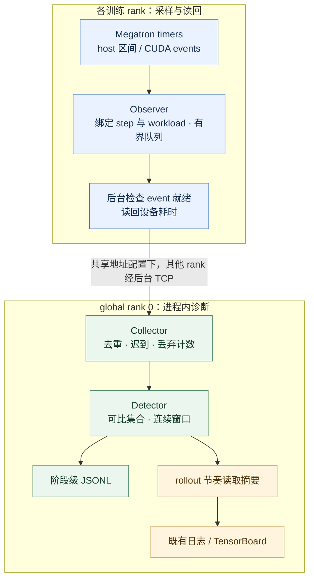

## 改动目的

为 Megatron 训练增加默认关闭的慢 rank 诊断。沿用 timer 挂点记录 host/CUDA stream 区间，以可比 rank 的连续窗口定位阶段偏差，并接入已有日志与 TensorBoard。设计与取舍见 [RFC #357](https://github.com/redai-studio/Relax/issues/357)。

**保持 Draft。** 当前 PR 头 `c2875a5` 的 CI 8/8 通过；产品代码固定于 `927c5de`，后续只有 Python 3.10 测试竞态修复。C1 尚无当前产品的正式开销结论，实时上报和 Attention/MoE 范围待导师裁决。

## 实现与审查入口

Collector 在 global rank 0 训练进程内；未配置共享地址时各 rank 本地汇总。图示为 CUDA 读回路径，host-only 降级可能在调用线程交付。CUDA event 含流上等待，不能解释为纯 kernel 或通信时长。

建议按以下顺序审查：

- [timer shim](https://github.com/redai-studio/Relax/blob/c2875a5c219fcef38011ea93ce617b74a8efef08/relax/utils/straggler/megatron_timer_shim.py)、[observer](https://github.com/redai-studio/Relax/blob/c2875a5c219fcef38011ea93ce617b74a8efef08/relax/utils/straggler/observer.py)：区间结束时绑定上下文；有界 event/队列；后台就绪检查与 host-only 顺序。
- [runtime](https://github.com/redai-studio/Relax/blob/c2875a5c219fcef38011ea93ce617b74a8efef08/relax/utils/straggler/runtime.py)、[collector](https://github.com/redai-studio/Relax/blob/c2875a5c219fcef38011ea93ce617b74a8efef08/relax/utils/straggler/collector.py)：共享地址、TCP 汇总、重复/迟到/丢弃及退出 flush；文件写入和外部回调移出状态锁。
- [detector](https://github.com/redai-studio/Relax/blob/c2875a5c219fcef38011ea93ce617b74a8efef08/relax/utils/straggler/detector.py)：工作量可比集合内选最快参照；候选 streak 与 active 告警分离；低负载或证据不足不产生假恢复。
- [reporter](https://github.com/redai-studio/Relax/blob/c2875a5c219fcef38011ea93ce617b74a8efef08/relax/utils/straggler/reporter.py)、[平台指标](https://github.com/redai-studio/Relax/blob/c2875a5c219fcef38011ea93ce617b74a8efef08/relax/utils/training/train_metric_utils.py)、[回归测试](https://github.com/redai-studio/Relax/tree/c2875a5c219fcef38011ea93ce617b74a8efef08/tests/utils/straggler)：确认指标归属、只读摘要、故障隔离和 Python 版本行为。

## 当前验证

| 项目            | 结果与边界                                                                                                             | 证据                                                                                                                                                                                                                                                              |
| --------------- | ---------------------------------------------------------------------------------------------------------------------- | ----------------------------------------------------------------------------------------------------------------------------------------------------------------------------------------------------------------------------------------------------------------- |
| 当前头 CI       | `c2875a5` 8/8 通过：pre-commit、Python 3.10/3.11/3.12、H20 四卡单测及三项训练集成                                      | [CI](https://github.com/redai-studio/Relax/actions/runs/36558249666) · [GPU](https://github.com/redai-studio/Relax/actions/runs/36558249592) · [集成](https://github.com/redai-studio/Relax/actions/runs/36558249838)                                             |
| C1              | `e961661` 六对 `perf/train_time` pilot：+0.417%，95% CI 上界 +2.023%，**INCONCLUSIVE**；当前产品确认实验未运行         | [pilot](https://github.com/shanyulu/Relax/blob/1c23f03d3553e26194c09f90d2ce0e85f7895c00/evidence/gpu_campaign/abba-e961661-run1/verdict.json)                                                                                                                     |
| C2 参数         | `927c5de`，两对 OFF/ON 各 182/182 entries 在冻结容差内，完整 lineage/数值复算通过；大原件仅本地                        | [复算](https://github.com/shanyulu/Relax/blob/1c23f03d3553e26194c09f90d2ce0e85f7895c00/evidence/gpu_campaign/task11_3090/c2_parameter_replay_20261001/PARAMETER_REPLAY_20261001.md)                                                                               |
| C2 loss/grad    | `927c5de`，独立八臂、48 步/臂，**PASS_WITHIN_OFF_OFF_ENVELOPE**；公开下载包重算通过                                    | [八臂审计](https://github.com/shanyulu/Relax/blob/1c23f03d3553e26194c09f90d2ce0e85f7895c00/evidence/gpu_campaign/task11_3090/native_loss_927c5de/TOOL_GATE_AUDIT_SOURCE_REMAP_20261001.md)                                                                        |
| C2 3090 overlap | 独立八臂，允许下降 0.00145552；两对 Δ +0.00056297 / −0.00022059，**PASS（冻结门槛）**                                  | [判定](https://github.com/shanyulu/Relax/blob/1c23f03d3553e26194c09f90d2ce0e85f7895c00/evidence/gpu_campaign/task11_3090/trace_overlap/O_MEASUREMENT_RESULT.json) · [trace 原件](https://github.com/shanyulu/Relax/releases/tag/task11-evidence-20261001-1c23f03) |
| C3              | rank 3 四个阶段标签命中，最大偏差 6.869×；健康臂零确认告警、37 uncertain；三条非目标告警按冻结代理规则分类，成因未证实 | [公开输入复算](https://github.com/shanyulu/Relax/blob/1c23f03d3553e26194c09f90d2ce0e85f7895c00/evidence/C3_RECOMPUTATION_REVIEW_20260930.md)                                                                                                                      |
| 平台            | rollout 级确认 rank 为 3、3、2、2；无逐事件关联 ID，事件级时延 **UNMEASURED**，“实时”待裁决                            | [C3 原始包](https://github.com/shanyulu/Relax/tree/1c23f03d3553e26194c09f90d2ce0e85f7895c00/evidence/gpu_campaign/c2p-927c5de/c3-v2)                                                                                                                              |

参数 182 entries 实际是 **13 个非空浮点 storage 组＋169 个空 TE 占位**，不是 182 个独立样本。非张量叶每对 47/48 一致，唯一差异叶为含运行态字段的 `args`；完整恢复状态等价未证明。[覆盖审查](https://github.com/shanyulu/Relax/blob/1c23f03d3553e26194c09f90d2ce0e85f7895c00/evidence/PARAMETER_COVERAGE_REVIEW_20260930.md)明确模型、optimizer 与排除项。

loss/grad 两对最大差分别为 0.05001947 / 0.04827869 和 8.384097 / 12.530714，冻结限值分别为 0.23347807、57.434275。容差来自四个新 OFF 臂的六个共享对照，首个新 ON 前冻结。条形图不是置信区间，这项门槛不证明精度不变或统计等价性。

参数实验 P-M1/P-M2 的原 loss/grad 旁证属于 `927c5de`，未提前冻结 band，继续 **UNSCORED**；新 L-M 补验独立判定。`a48a23b` 的旧 overlap **NOT_PASS** 保留，不由新版本或新机器结果覆盖。整体 C2 仍需维护者接受分项组合与覆盖范围。

## 原始证据与复算

[不可变 evidence](https://github.com/shanyulu/Relax/tree/1c23f03d3553e26194c09f90d2ce0e85f7895c00/evidence)提供协议、审计工具、verdict 和原件台账；[Release](https://github.com/shanyulu/Relax/releases/tag/task11-evidence-20261001-1c23f03)提供 917,446 字节的 native-loss 小包及八个 3090 trace 包。发布后已重新下载、核验冻结哈希并复算，见[公开下载复算记录](https://github.com/shanyulu/Relax/blob/41f2521cfef7dd3dc2bbd8e10dbb3f8a8dccf5de/evidence/public_download_replay_20261001/PUBLIC_DOWNLOAD_REPLAY.md)。小包 SHA-256 为 `af1aff9db1b8c4f251b23b7e56d25d9b487fb43e1ee15bcc5259695b5e1f72c2`，96 项清单全匹配；新工具三套测试共 71 项通过。

参数的约 258 GiB checkpoint/转换原件仍只在本地；公开结果与哈希不能代替完整原件和独立备份。[既有 4090 overlap 的 32 件 trace](https://github.com/shanyulu/Relax/tree/1c23f03d3553e26194c09f90d2ce0e85f7895c00/evidence/gpu_campaign/c2p-927c5de/trace_dp4)与新 3090 实验分别归档。

Observer-only 自然告警与终态证据限制

两条无所核查减速注入项的 ON 运行共 4,011 条 envelope，已保存 verdict payload 完整复放匹配 M1 145/145、M2 139/139：七条确认告警，六条有保存恢复，一条在快照中仍 active。原因未知，不能据“未注入”认定误报。

离线 flush 另得到五个尾窗候选。两份状态快照均 `closed=false`，各有两个 open windows，pending readouts 为 6/1，快照早于作业完成。现有证据无法证明最终零丢弃或最终告警总数。[逐条窗口与参照分析](https://github.com/shanyulu/Relax/blob/1c23f03d3553e26194c09f90d2ce0e85f7895c00/evidence/gpu_campaign/task11_3090/native_loss_927c5de/NATURAL_ALERT_REVIEW_20261001.md)保留工作量、覆盖率、恢复和解释边界。

## 审查与验收待办

1. 导师确定 C1 主指标后，在最终产品上预注册固定 N、顺序、分析器与停止规则，完成正式确认实验。
2. 确认现有 rollout cadence 是否满足实时上报；JSONL 与 TensorBoard 尚不能计算逐事件端到端时延。
3. 确认 Attention/MoE 是否要求实际插桩；当前为 schema 预留，真机证据限于单机 dense DP4，PP>1 尚未验收。
4. 完成大参数原件的独立存储与第三方完整复算；observer-only 终态 accounting 仍有证据缺口。

满足当前头 CI、正式 C1 结论、C2 覆盖获接受、C3 与范围裁决及无未解决评审线程后，再转 Ready for review。
