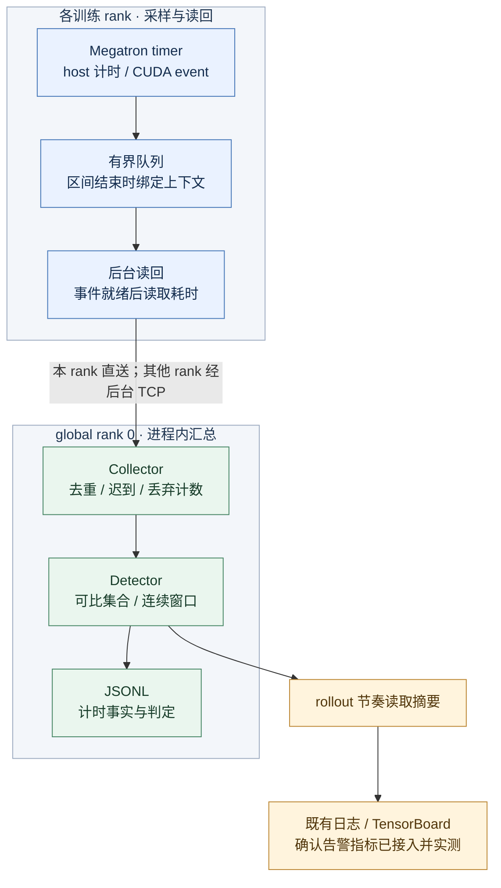
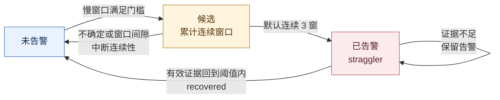

提案人：@shanyulu · 导师：@Lemon-412 · 实现：[Draft PR #378](https://github.com/redai-studio/Relax/pull/378)

## 1. 目标与边界

训练变慢时，首先要回答：**哪个 rank、哪个阶段出现持续偏差，比较对象是否可比，证据能支持到哪一步。** 本提案复用 Megatron timer，记录 host 与 CUDA stream 区间，在后台汇总窗口，并接入 Relax 现有日志和 TensorBoard。

功能默认关闭。公开产品链：`a48a23b`（冻结）→ `927c5de`（确认告警指标、静默摘要读取、collector 状态锁隔离、指南修正）→ [c2875a5](https://github.com/shanyulu/Relax/commit/c2875a5c219fcef38011ea93ce617b74a8efef08)（仅测试文件的 P3.10 竞态修复，`relax/` 零变更，当前 PR 头，**CI 8/8 通过**）。性能与诊断验收仍未全部完成，PR 保持 Draft。CI 证明回归检查通过，不替代下文的 C1/C2/C3 实验。

[官方 Task 11](https://github.com/redai-studio/community/blob/main/contributor-program/2026-cohort-2/official-task.md#task-11)要求：整体性能开销小于 0.5%；真实 E2E 不影响训练精度、loss 和既有通算重叠收益；通过现有平台实时、清晰地定位慢卡。下文的置信区间、配对实验和参数比较是本提案采用的验证方法，不是额外声称的官方条款。

## 2. 接入架构

图示为启用 CUDA 计时、配置共享 collector 地址的路径。Collector 位于 **global rank 0 的训练进程内**，不是独立服务；未配置共享地址时，各 rank 仅本地汇总，不能获得完整跨 rank 诊断。

| 层次       | 职责                                                        | 不承担的职责                                                     |
| ---------- | ----------------------------------------------------------- | ---------------------------------------------------------------- |
| Timer shim | 沿用 Megatron 计时挂点；记录 host 区间、CUDA event 和上下文 | 不开启全程 profiler，不据此宣称开销已经达标                      |
| Observer   | 有界排队、后台设备读回、记录降级与丢弃                      | 不保证无损采集；不等待所有 rank 到齐                             |
| Collector  | 汇总 envelope，按运行、拓扑版本、rank、序号去重             | 不新增训练 collective，不负责训练调度                            |
| Detector   | 按拓扑与工作量选参照，判断持续异常与恢复                    | 不把耗时差异直接归因为硬件、网络或算子故障                       |
| Reporter   | 导出已有性能日志与 TensorBoard 确认告警指标                 | 按 rollout 汇总，不能与某一条 JSONL 判定逐事件关联；实时性待裁决 |

源码入口：[timer shim](https://github.com/shanyulu/Relax/blob/c2875a5c219fcef38011ea93ce617b74a8efef08/relax/utils/straggler/megatron_timer_shim.py)、[observer](https://github.com/shanyulu/Relax/blob/c2875a5c219fcef38011ea93ce617b74a8efef08/relax/utils/straggler/observer.py)、[runtime](https://github.com/shanyulu/Relax/blob/c2875a5c219fcef38011ea93ce617b74a8efef08/relax/utils/straggler/runtime.py)。

### 为什么选择这条路径

沿用 timer 可以覆盖训练阶段而不要求持续开启 Kineto；将 CUDA event 读回移到后台，避免为观测显式等待设备。但采样、排队、序列化和汇总仍有成本，必须实测。Kineto 仅用于独立检查 overlap，不能用其 trace 反证本功能的常驻开销已低于 0.5%。

CUDA event 给出的是**流上可观察区间**，可能包含等待，不等于纯 kernel 时间或纯 NCCL 通信时间。嵌套或重叠阶段也不能直接相加为整步耗时。

## 3. 记录顺序与失败行为

区间结束时绑定 workload 和 step 上下文，再进入读回队列；不能在读回时取“当前 step”，否则会把第 N 步计时与第 N+1 步工作量拼接。序号按区间完成顺序分配，不按开始顺序分配。

| 情况                              | 当前行为与限制                                                          |
| --------------------------------- | ----------------------------------------------------------------------- |
| CUDA event 尚未就绪               | 后台轮询；超出读回限制后降级，设备耗时不可用，不填成 0                  |
| 设备计时路径中出现 host-only 记录 | 仍走同一待处理队列，避免越过更早的设备记录                              |
| 纯 host-only / 无 CUDA 模式       | 可在调用线程直接交付；不能概括为“所有汇总都在后台”                      |
| 队列耗尽、记录迟到或重复          | 有界处理并独立计数；丢失不等于正常样本                                  |
| 后续没有新记录                    | 窗口不会仅因墙钟到期就自动结算；需后续记录推进或显式 flush              |
| 摘要读取                          | `927c5de` 已实现静默摘要读取；训练线程是否零 I/O 仍以具体路径和测试为准 |

默认窗口为 5 秒，但这不是“5 秒内平台可见”的 SLA：窗口推进、连续判定、导出节奏和平台接收是不同环节，必须分别测量。

## 4. 如何判断慢 rank

先按拓扑与阶段建立 cohort，再为每个 rank 选择工作量可比的参照成员。比较值为**该 rank 的窗口 host 耗时中位数，相对其可比集合中最快成员的偏差**；不是相对全体 rank 最快值，也不是相对 cohort 平均值。

工作量使用单样本 token 数的窗口中位数，避免“慢 rank 在窗口内完成更少样本”被误当成工作量不同。[判定实现](https://github.com/shanyulu/Relax/blob/c2875a5c219fcef38011ea93ce617b74a8efef08/relax/utils/straggler/detector.py)保留参照成员、有效覆盖和工作量证据。

图示为有足够参照成员、未触发有界状态淘汰时的告警生命周期。默认相对阈值为 5%，并有绝对耗时门槛；低于门槛的相对偏差不能单独触发告警。候选连续计数与已生效告警分开维护：不确定窗口会打断新告警的连续性，但不能作为恢复证据。

**工作量缺失与不可比必须区分：**

- 有工作量、但找不到足够可比参照：不作有效慢卡判断，记录不确定或不足原因。
- 工作量缺失：当前实现退回 cohort 时间比较，并标记 `workload_evidence_degraded=true`；仍可能产生判定。它不是“已证明等工作量”，也不是一律输出 uncertain。
- `host_only_stall`、`gpu_stream_stall` 是诊断提示；根因仍需结合训练、通信或设备证据确认。

## 5. 当前验收与实验结果

公开证据固定于 [7098b43](https://github.com/shanyulu/Relax/tree/7098b43/evidence)。以下新增 3090 结果为本地发布候选，尚未推送：参数正式判定固定于 `116d527`；独立覆盖审查、便携复算工具与归档台账将随本次本地提交交付。历史结果按运行产品 SHA 和原协议解释，不用新门槛重标旧实验。

| 验收                     | 产品版本                    | 结果                                                                                                                                                                                                                                                                                       | 尚缺什么                                                                                    |
| ------------------------ | --------------------------- | ------------------------------------------------------------------------------------------------------------------------------------------------------------------------------------------------------------------------------------------------------------------------------------------ | ------------------------------------------------------------------------------------------- |
| C1：整体开销 \<0.5%      | e961661                     | **INCONCLUSIVE**；6 对 pilot 均值 +0.417%，95% CI \[-1.295%, +2.023%\]                                                                                                                                                                                                                     | 主指标裁决；最终产品上的固定样本量确认实验                                                  |
| C2：历史训练指标         | a48a23b                     | 两对 ON/OFF 的 loss、梯度范数、学习率和 token 检查通过                                                                                                                                                                                                                                     | 历史参考，不作为当前产品验收                                                                |
| C2：最终 checkpoint 参数 | 927c5de／4×3090             | **本地 PASS**：13 个有内容浮点组通过冻结数值包络，169 个空占位项的身份与结构匹配                                                                                                                                                                                                           | 原件公开存储与恢复；不代表位确定性或完整 optimizer 恢复状态等价                             |
| C2：独立 loss／grad 补验 | 927c5de／4×3090             | **本补验 PASS**：4 个 OFF 校准臂、2 对 OFF/ON 测量臂，各 48 步；loss Δ≤0.05002/0.04828（限值 0.23348），grad Δ≤8.3841/12.5307（限值 57.4343）                                                                                                                                              | 原始日志目前仅本地可复算；该结果不改写旧 UNSCORED 记录，也不等同整体 C2 通过                |
| C2：先前原生训练旁证     | a48a23b                     | 48/48 更新、step/token/LR 一致、数值 NaN/Inf 为 0                                                                                                                                                                                                                                          | 当时 loss／grad 未冻结容差，旧判定仍为 UNSCORED                                             |
| C2：3090 独立 overlap    | 927c5de                     | **本地 PASS**；允许下降 0.001455524，Δ +0.000562970 / −0.000220593                                                                                                                                                                                                                         | 32 件 trace 大归档待公开存储；不覆盖旧结果                                                  |
| C2：先前已公开 overlap   | **927c5de／先前机器及协议** | **PASS**；独立校准会话冻结包络 0.029499，两对 AB/BA 通过（Δ -0.000484 / -0.002609）；a48a23b 的 NOT PASS 按其版本保留                                                                                                                                                                      | 不与本轮 3090 合并样本                                                                      |
| C3：定位与平台上报       | **927c5de**                 | [结果摘要](https://github.com/shanyulu/Relax/blob/7098b43/evidence/gpu_campaign/c2p-927c5de/c3-v2/C3_RESULT.md)：健康臂 37 条均为 uncertain、零确认告警；注入 rank 3 有 4 条确认告警、最大偏差 6.869×；TB 汇总 rank 为 3、3、2、2；另有 3 条非目标告警，按冻结代理规则计为误报，原因未证实 | 本地待公开输入包独立复算一致；原件尚无公开下载渠道；“实时”口径待裁决，逐事件时延 UNMEASURED |

3090 overlap 的 PASS 仅表示两对 ON−OFF 差值（+0.000562970、−0.000220593）均高于预先冻结的 −0.001455524 下降界限。它不证明严格零影响，也不能代替 C1 的 \<0.5% 总开销验收；先前机器与协议的 0.029499 门槛及结果只适用于表中单列的历史实验。

### C1：点估计不是通过结论

| 配对顺序                   |   S1 AB |   S2 BA |   S3 AB |   S4 BA |   S5 AB |   S6 BA |
| -------------------------- | ------: | ------: | ------: | ------: | ------: | ------: |
| `perf/train_time` 相对 OFF | +2.177% | +1.779% | −2.308% | +2.433% | +1.393% | −2.970% |

A 为 OFF，B 为 ON；每臂 48 步。配对波动跨越 0.5% 门槛，不能只看均值或挑选有利配对。正式判定使用**配对差均值的区间上界**。

`Δᵢ = 100 × (mean(ONᵢ) / mean(OFFᵢ) − 1)`；6 个 Δᵢ 的均值为 +0.4174268%。按 pair 重采样的 bootstrap 95% CI 上界为 +2.0227648%，因此不能证明开销小于 0.5%。[原始判定与配对值](https://github.com/shanyulu/Relax/blob/afd45fb04de9306b2e65f851ee2b7c7dbbe917b4/evidence/gpu_campaign/abba-e961661-run1/verdict.json)。

### C2：分清指标一致、参数等价和 overlap

**当前 3090 参数测量已完成。** 四个 OFF 校准臂先冻结逐张量容差，再按 `M1 OFF→ON、M2 ON→OFF` 跑四个 48 步测量臂。`116d527` 的判定为两对 PASS，范围仅为保留的最终 checkpoint 在冻结包络内。

182 项中，13 项有浮点内容：10 个 BF16 模型组共 596,049,920 元素，三个 FP32 optimizer 组各同规模；另 169 项为空占位。DCP→adapter→inventory 的 key、shape、dtype 及 chunk 覆盖经独立元数据核查。48 个非 tensor 叶未比较，因此不是完整 optimizer 恢复状态等价；此审查也不是重新转换 checkpoint。

此前 `a48a23b` 的 loss 最大逐步差为 0.046285／0.030037，grad norm 为 7.94949／5.50596。因首个 ON 前未冻结同版 band，旧结果仍为 **UNSCORED**。之后另行预注册并完成的 `927c5de` loss／grad 补验通过其自身 OFF/OFF 包络；它不回溯修订旧结果，也不替代参数、overlap 或整体 C2 验收。旧协议的“bit-equal”依独立勘误解释为数值相等；原比较器和旧结果不修改。

上述图片为本地候选；授权发布时替换为经验证的不可变证据链接。八臂 checkpoint、转换和 payload 仍保留本地，完整第三方公开复算尚未闭环。

本轮审查与复算工具固定于本地 `021bbd69b9f7654af68cee9ba10687e0710e59ca`：[参数覆盖及 loss 门禁](../../evidence/PARAMETER_COVERAGE_REVIEW_20260930.md)、[便携复算](../../evidence/PARAMETER_REPLAY_GUIDE_20260930.md)、[trace 归档](../../evidence/gpu_campaign/task11_3090/trace_overlap/ARCHIVE_RECOMPUTATION_20260930.md)、[C3 重算](../../evidence/C3_RECOMPUTATION_REVIEW_20260930.md)。完整 optimizer 非张量状态、真实大参数跨位置恢复，不在这些已通过检查的范围内。

[两对训练指标对照](https://github.com/shanyulu/Relax/blob/f69343f80ce6b0b7339b30748c3361c7bdd42101/evidence/gpu_campaign/c2-a48a23b/measurement/C2_COMPARE.json)中，loss 最大绝对差分别为 0.10148、0.03789，均在预先冻结的 0.13927 包络内；学习率序列一致，token 差为 0。但旧分析器在 checkpoint 不同的分支没有逐张量比较，故[复核判定](https://github.com/shanyulu/Relax/blob/f69343f80ce6b0b7339b30748c3361c7bdd42101/evidence/gpu_campaign/c2-a48a23b/measurement/C2_COMPARE_REVIEWED.json)为 **INCOMPLETE**，不能沿用旧版顶层 PASS。

旧版 a48a23b overlap 在原冻结门槛下 [NOT PASS](https://github.com/shanyulu/Relax/blob/afd45fb04de9306b2e65f851ee2b7c7dbbe917b4/evidence/gpu_campaign/c2-a48a23b/trace_dp4/TRACE_VERDICT.json)；927c5de 另起独立校准与测量，在自己的门槛下 [PASS](https://github.com/shanyulu/Relax/blob/7098b43/evidence/gpu_campaign/c2p-927c5de/overlap-v2/O_MEASUREMENT_RESULT.json)。两次判定均保留，不用新门槛重标旧结果。[新版 32 件原始 trace 与双哈希台账](https://github.com/shanyulu/Relax/tree/7098b43/evidence/gpu_campaign/c2p-927c5de/trace_dp4)可下载复算。`cudaDeviceSynchronize` 计数一致只说明该 API 未新增调用，不能排除其他同步。

### C3：阶段定位与平台确认是两种粒度

927c5de 的[结果摘要](https://github.com/shanyulu/Relax/blob/7098b43/evidence/gpu_campaign/c2p-927c5de/c3-v2/C3_RESULT.md)记录：健康臂 37 条判定均为 uncertain、零确认告警；减速臂在目标 rank 3 的四个阶段标签产生 4 条确认告警。TensorBoard 的 `confirmed_straggler_rank` 在两个 rollout 显示 3，另两个 rollout 显示 2；不能只摘前两点写成平台没有非目标告警。3 条非目标告警按冻结的窗口代理规则计入误报，但它们的因果来源未证实。

JSONL 保留阶段、rank、窗口和类别；TensorBoard 只保留 rollout 级汇总，不带同一事件 ID。因此只能分别验证阶段定位和平台确认，**不能做逐事件 join，也不能报告端到端告警延迟**。早期用日志时间差推得的 p50/p95 已撤回；本版时延为 **UNMEASURED**。本地待公开输入包已独立重算且与冻结结果一致；原始两臂尚未公开，第三方仍不能从公开仓库完整复算。

## 6. 支持范围与待决定事项

| 范围            | 当前实现 / 证据                                         | 本期边界                                   |
| --------------- | ------------------------------------------------------- | ------------------------------------------ |
| 训练阶段        | 既有 forward/backward、通信、optimizer timer 挂点       | 区间与提示，不承诺硬件根因定位             |
| Attention / MoE | schema 预留                                             | 没有对应真实插桩验收，是否接受须由导师确认 |
| 拓扑与规模      | 当前真机证据集中在单机 dense DP4                        | 不外推为多机、MoE 或复杂 PP 已验收         |
| 平台导出        | rollout 节奏接入现有日志 / TensorBoard                  | 是否满足“实时”待裁决                       |
| PP > 1          | 汇总者为 global rank 0，导出主 rank 可能位于末 PP stage | 平台汇总归属未闭合，不宣称完整支持         |

以下三项待导师确认，决策与后续结果统一维护在本节：

1. **C1 主指标**：以 `perf/train_time` 还是 whole-job wall-clock 判定整体开销；另一项保留为辅助指标。
2. **C3 实时语义**：现有 rollout-cadence 导出是否可接受；若不可接受，先审最小异步导出设计。
3. **Attention/MoE 范围**：本期是否要求实际粗粒度插桩，而非仅 schema。

当前待办是大原件与本轮原始日志的公开存储及恢复验证、C1 主指标与确认实验，以及 rollout 实时口径和 attention/MoE 范围裁决。参数测量和独立 loss／grad 补验均已完成，不再重复烧 GPU。C1 须先冻结产品版本、固定样本量、分析器和停止规则，不能增加试次直到通过。

早期设计与机制实验（不计入当前产品验收）

- [多会话 standalone 实验与原始数据](https://github.com/shanyulu/Relax/tree/8214cd7426885e94c931c91b2483086e310558ea/demos/task11_straggler/results/multisession-20260924)：用于检查采集机制、会话漂移及 OFF/OFF 对照，不能替代真实 Relax 接入后的 C1/C2/C3。
- [最初的真实接入计划](https://github.com/shanyulu/Relax/blob/a59686959751b24f605e37f63198e4acfba5f56f/TASK11_C2_PLAN.md)：记录 timer shim 的选型与接入边界；当前实现、估计量和未完成项以本文为准，不沿用旧计划的阶段结论。

